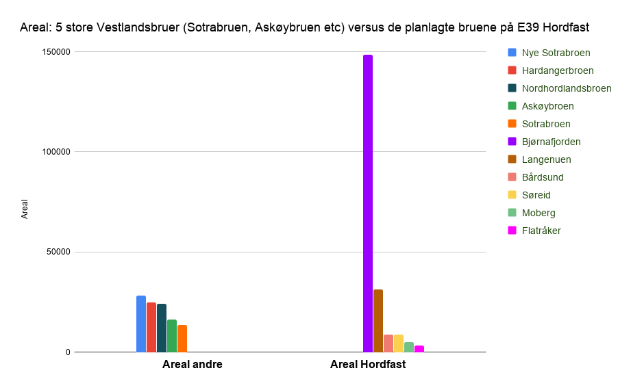
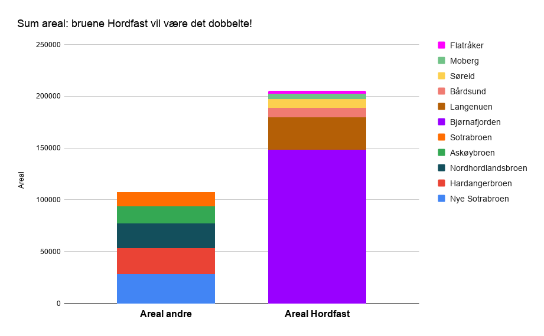

Dette er første blogg på vår nye nettside! Foreløpig har nettsiden ikke så veldig mye
stoff, men det kommer mer etterhvert. Arbeidet med nettsiden er 100 % ubetalt.

Tenker at bloggen her skal komme med innspill til debatten, "fun facts" og annet
vedrørende trafikkøkningsprosjektet [Hordfast](https://no.wikipedia.org/wiki/Hordfast).

Den første "fun fact" som her presenteres er hvor mye broareal Hordfast-planen
innebærer. Med areal menes her brolengde multiplisert med full bredde.

Dette blir illustrert med å sammenligne Hordfast med noen av våre kjente broer:
Sotrabroene (gamle + den nye som ennå ikke er bygget), Askøybroen, Nordhordlandsbroen
(flytedel + fastdel) og Hardangerbroen.

Tallene er basert på rapporter fra Statens Vegvesen (SVV), Wikipedia og med manuell
måling på kart.

Summerer vi dette får man

De andre broene dekker i dag en trafikk på ca. 67 000 kjøretøy per døgn
([ÅDT](https://no.wikipedia.org/wiki/%C3%85rsd%C3%B8gntrafikk)). Hordfast-korridoren har
i dag en ÅDT på ca. 3 500 kjøretøy. Etterhvert mener SVV at det skal bli fra 12 000 til
15 000 biler dersom Hordfast blir realisert. Og dersom det ikke er bompenger, vel og
merke ...

Hvor dyrt kommer ikke dette egentlig til å bli i byggekostnader? Og hvor dyrt blir det
ikke med tap av unike naturverdier, kulturminner og fritidsområder? Galskap!

Se også
[dette innlegget i BA fra 2022](https://www.ba.no/hordfast-er-meningslost-og-svindyrt/o/5-8-1817081)
