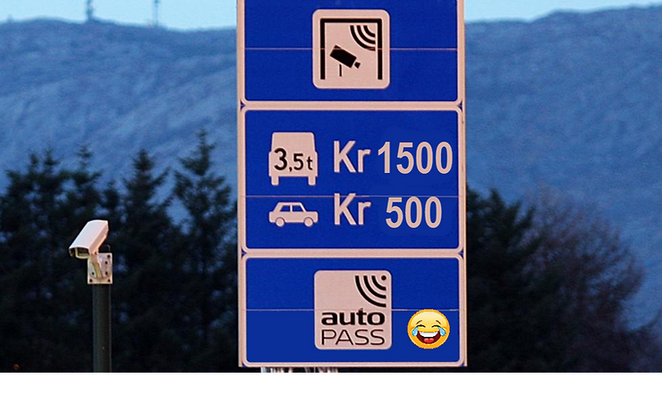
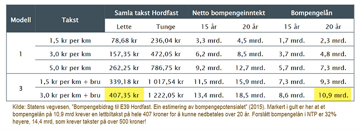

[Ordførere i Sunnhordland og Haugalandet skriver i BA rett før påske](https://www.ba.no/hordfast-er-nokkelen/o/5-8-1874181)
(13 april, 2022) at motorveiprosjektet Hordfast er nøkkelen til omstilling og det grønne
skiftet(!), og hevder videre at veiprosjektet vil være en "avgjørende konkurransefaktor"
fremover. Stikkordene i dette "grønne skiftet" er "bedre mobilitet og utvidede bo- og
arbeidsmarked". Eller oversatt: kraftig økning av trafikken, høyere fart, mer og lengre
pendling mellom kommuner og flere biler i kø inn mot byene.

Implisitt her er at de ikke bare ønsker seg Hordfast, men også videre utbygging av
4-felts motorvei mellom Stord og Bokn.
[Planleggingen av dette er allerede i gang](https://www.vegvesen.no/vegprosjekter/europaveg/e39boknstord/).
Det må jo gå i 110 km/t hele veien mellom Bergen og Stavanger, ellers knekker visstnok
hele vest-Norge sammen får vi inntrykk av. Og ikke nok med, i tilknytning til Hordfast
jobbes det også for [fjordkryssing-prosjektet Sunnfast](https://sunnfast.no/) (som
allerede har en
[betalt lobbyist ansatt på heltid](https://www.sunnhordland.no/nyhende/hentar-tidlegare-ordforar-i-ny-lobby-stilling-slik-skal-dei-fa-gjennomslag-for-sunnfast-prosjektet/)),
og kanskje også
["Austevollfast"](https://www.bt.no/nyheter/lokalt/i/m5qPq/austevoll-vil-bli-landfast).

Videre hevder de, uten å blunke, at fergefri vei mellom Stavanger og Bergen er "et
prosjekt som samlet sett vil gi store gevinster både for samfunnsnytte og for
klimautslipp". Hvor i all verden har de nevnte ordførerne hentet disse påstandene fra?

## Store gevinster for samfunnsnytte?

For å ta "samfunnsnytte" først:
[I Nasjonal Transportplan (NTP)](https://www.regjeringen.no/no/tema/transport-og-kommunikasjon/nasjonal-transportplan/id2475111/)
sies det nå at netto nytte for Hordfast er relativ lav, ca. 1 milliard etter korrigert
pris på Hordfast (38,5 mrd). Forlengelsen av Hordfast på Stord,
["Heiane-Ådland/Nordre Tveita"](https://www.vegvesen.no/vegprosjekter/europaveg/e39leirvik/),
vil i følge
[en revidert plan fra 2019](https://trafikksikkerhetsforeningen.no/wp-content/uploads/2020/10/2019_10_01_oppdrag_1_vedlegg_1_prosjektomtaler_1.pdf)
koste omlag 2,6 mrd og ha en netto nytte på minus 1,5 mrd. Samlet betyr dette en netto
nytte for hele Os-Bokn til å bli negativ på minus 12 milliarder. Totalt er altså hele
Os-Bokn et tapsprosjekt med en kostnad på 64 milliarder kroner og en "nytte" på minus
12,3 milliarder i utgangspunktet. Det er mye penger!

Og dette er
[før alle kostnadssprekkene vi kan forvente](https://www.ba.no/de-store-veiprosjektene-sprenger-prisantydningene/s/5-8-1868088).
Ved 30% kostnadssprekk (som er moderat gitt erfaringen fra andre store prosjekter) så
blir totalprisen fra Os til Bokn bli på om lag 83 milliarder, og få negativ nytte på
over 31 milliarder. Og 31 milliarder er
[nær et halvt norsk forsvarsbudsjett](https://www.regjeringen.no/no/aktuelt/okninger-i-forsvarsbudsjettet-for-2021/id2889829/)!

Men dette er kun den "prissatte" samfunnsnytten. De
[store og irreversible inngrepene i verneverdig og rødlistet natur](https://www.bygg.no/statsforvalteren-i-vestland-bekymret-for-naturinngrep-pa-e-39/1487997!/)
og videre ødeleggelse av de mange kulturminnene, landskapsbildet, matjord og de flotte
friluftsperlene som finnes i Sunnhordland er ikke nevnt med ett eneste ord av disse
ordførerne! Oppsummert er nytten for disse "ikke-prissatte" kostnadene "stor til meget
stor negativ", i følge SVV egne rapporter og (ikke minst) Statsforvalteren sin kraftige
kritikk av prosjektet (se for eksempel hva
[Statsforvalteren skriver i sin høring til planprogrammet for reguleringsplan](https://drive.google.com/file/d/1TQTBGKOr4pHGbpUKr7e2U_Gt3VPdeBtn/view?usp=sharing),
høsten 2021).

Vedlikeholdet av vei, broer, tunneler etc vil koste store summer årlig, estimert til
minst 350 millioner per år! Med
[begrensede samferdselsmidler](https://www.faktisk.no/artikler/jeo3x/har-regjeringen-doblet-samferdselsbudsjettet)
må vi
[heller prioritere det store etterslepet vedlikehold og sikring av eksisterende veier](https://www.veier24.no/artikler/naf-mange-mener-at-vedlikehold-av-veiene-er-viktigere-enn-nybygging/512567)
på vestlandet i resten av Norge. Samt at man må sørge for at
[nedbygging av natur](https://www.sabima.no/hva-truer-naturen/arealendringer/) stopper
umiddelbart, [slik FN krever](https://news.un.org/en/story/2021/02/1085382)!

## Men hva med netto ringvirkninger da?

Netto ringvirkninger er en
[en beregning av "mernytte"](https://www.moreforsk.no/publikasjoner/rapporter/transportokonomi/beregningsmetodikk-for-netto-ringvirkninger-av-samferdselsinvestering/1094/3270/)
som i teorien skal ta inn nytte (og ulemper!) som den vanlige (trafikant-)nytten ikke
plukker opp. Temaet er
[imidlertid omstridt, og metodikk og tall spriker](https://uia.brage.unit.no/uia-xmlui/handle/11250/2561960)
kraftig. Dessuten viser Nordlandsforskning at
[resultatet synes også å være påvirket av hvem som oppdragsgiver](https://www.nordlandsforskning.no/sites/default/files/files/NF-rapport%2008_2018.pdf).
I NTP er mernytte derfor kun ansett som tilleggsinformasjon. Men dette kan uansett ikke
redde regnestykket til Bokn-Os.

Statens Vegvesen mener at
[mernytten til Hordfast om lag 1,4 mrd i innspill til NTP](https://www.regjeringen.no/contentassets/13a80858d58a47e1a23e944b7144ee9b/2020-03-26-oppdrag-9-til-sd-korrigert-versjon.pdf).
For Bokn-Stord
[finner Menon at tallet også er 1,4 mrd](https://www.menon.no/wp-content/uploads/Dokumentasjonsnotat-netto-ringvirkninger.pdf),
men det tallet er trolig for høyt da bompenger neppe er inkludert. Uansett, i sum altså
ca. 2,8 milliarder (og svært usikkert). For Heiane-Ådland har vi ikke funnet tall, men
mernytten på dette kortet strekket er trolig minimal. Så selv inklusiv mernytte blir den
samlede nytten likevel minus 9,5 milliarder.

## Store gevinster for klimautslipp?

[I følge regjeringen og stortinget](https://www.regjeringen.no/no/tema/klima-og-miljo/innsiktsartikler-klima-miljo/det-gronne-skiftet/id2879075/)
så handler "det grønne skiftet" om "hvordan Norge skal bli et lavutslippsland innen
2050", og "hvor vekst og utvikling må skje innenfor naturens tålegrenser". Merk innenfor
naturens tålegrenser og innen 2050!

Det haster enda mer faktisk: Regjeringen har nå som [ambisjon å kutte klimagassutslippet
med 55%](https://energiogklima.no/meninger-og-analyse/kommentar/toffe-klimam
aal-fra-store-men-hvor-er-tiltakene-som-kan-kutte-utslippene-med-55-prosent-pa-atte-ar/)
(fra 1990 nivå) innen 2030, Dvs vi må kutte over 3 millioner tonn per år de kommende
årene, og
[så langt går det smått](https://naturvernforbundet.no/klimarettferdighet-norges-ansvar-i-klimadugnaden/hvor-mye-utslipp-ma-den-ny...)

Nylig forsøkte
[en rapport fra Staten Vegvesen](https://www.bt.no/nyheter/innenriks/i/wOLwbn/hordfast-kalles-klimavinner-i-ny-rapport)
å grønnvaske utslippet fra Hordfast, men de måtte innrømme at utslipp fra bygging og
arealinngrep gjør klimaregnskapet negativt de første 55 årene! Så bare for Hordfast
alene så øker klimagassutslippet med om lag 0,8 millioner tonn i 2050.

Legger man på utslipp fra Stord-Bokn
([Nye Veier laget tall på det i innspill til NTP](https://www.regjeringen.no/contentassets/5a0bb3ce451a491f9648322a33f19bff/klimaeffekt-av-virksomhetenes-prioriterte-prosjekter-i-ntp-2022-2033-web.pdf))
så blir det ytterligere 0,56 millioner tonn, altså en netto økning av klimagassutslipp
på om lag 1,3 millioner tonn CO2-ekvivalenter i 2050.

Før 2050 er netto utslippet enda større (se figur). Så skal Regjeringen og Stortinget
kutte minst 3 millioner tonn per år fremover til 2030... blir det ikke da litt pussig å
gå inn for et transportprosjekt som over natten øker utslippene med minst 1,3 millioner
tonn?

## Avgjørende konkurransefaktor?

Hva med denne "avgjørende konkurransefaktoren" da?
[Eksportmeldingen til Menon](https://www.menon.no/wp-content/uploads/2021-58-Eksportmeldingen-2021.pdf)
viser at de fylkene som er desidert best på eksport per sysselsatt er Møre og Romsdal,
Vestland, Rogaland og Nordland. Som, kanskje ironisk nok, er også de fylkene som har
flest fergesamband (og minimalt med 4-felts motorvei)! Så kanskje det er andre elementer
enn "fergefri" som er "avgjørende konkurransefaktorer"?

Omtrent på samme tidspunkt som ordførernes innlegg i BA, var det et
[innlegg i BT underskrevet av et antall bedrifter i Sunnhordland og Haugalandet](https://www.bt.no/btmeninger/debatt/i/Wj5bWd/hordfast-er-viktig-for-omstilling-av-industrien)
med tittel "Hordfast er viktig for omstilling av industrien". Det er svært vanlig og til
dels forståelig at industrien ønsker seg "alltid litt bedre" infrastruktur enten de er
lokalisert i byer eller utenfor, men tiltakene må stå i forhold til nytten, både for de
prissatte og de ikke-prissatte. Erfaring viser
[at dyre veiutbygginger ikke redder utkant-Norge](https://www.dagsavisen.no/nyheter/innenriks/2021/03/01/veibygging-redder-ikke-utkant-norge/).

Mange av bedriftene på listen har allerede begynt "vekk-fra-olje" omstillingen med
suksess (for eks. [Aker Solutions](https://www.akersolutions.com/what-we-do/),
[Wärtsilä](https://www.wartsila.com/about),
[ABB Energy](https://new.abb.com/process-automation/energy-industries)) blant annet mot
grønnere skipsfart (bl.a. batteri og hydrogendrift av båter). Omtrent samtlige av disse
bedriftene skryter av "bærekraft" og "grønne verdier" på sine hjemmesider. Så er det
ikke da et tankekors at de i dette innlegget ikke nevner de svært store negative
miljøkonsekvensene ved motorveiprosjektene de ønsker med ett eneste ord?

Faktisk har vel kommunikasjonen Halhjem-Stord historisk aldri vært bedre enn den er nå,
med hyppige fergeavganger og
[stadig lavere priser](https://www.vg.no/nyheter/innenriks/i/8QEbGA/hurdal-plattformen-halv-pris-paa-fergebilletter-flere-faar-gratis-ferge).
Vi kan være rimelig sikker på at den dyktige industrien i Sunnhordland og på Haugalandet
vil klare seg helt fint uten Hordfast, slik at de har allerede har gjort i mange
generasjoner. Kanskje de nye mulighetene til
[å samarbeide digitalt over internett](https://kapital.no/reportasjer/naeringsliv/2020/10/07/7572294/coronakrisen-en-katalysator-for-det-digitale-skiftet)
(slik Koronapandemien har lært oss) er nøkkelen i stedet? Det sparer både miljøet for
store irreversible inngrep og de ansatte for
[stressende pendling](https://www.regus.no/work-norway/no-no/top-10-annoying-commuting-hassles/)
og reising! Og ikke minst har det desidert høyest samfunnsnytte, både for prissatte
kostnadene og (ikke minst!) for de ikke-prissatte!

## Oppsummert

Oppsummert så taper samfunnet store penger, klimagassutslippet øker kraftig, trafikken
øker og
[uerstattelige naturverdier](https://www.bygg.no/statsforvalteren-i-vestland-bekymret-for-naturinngrep-pa-e-39/1487997!/)
blir tapt for alltid ved Hordfast og videre utbygging av firefelts motorvei til Bokn. At
dette blir omtalt å være en del av det grønne skiftet er rett og slett pinlig!
