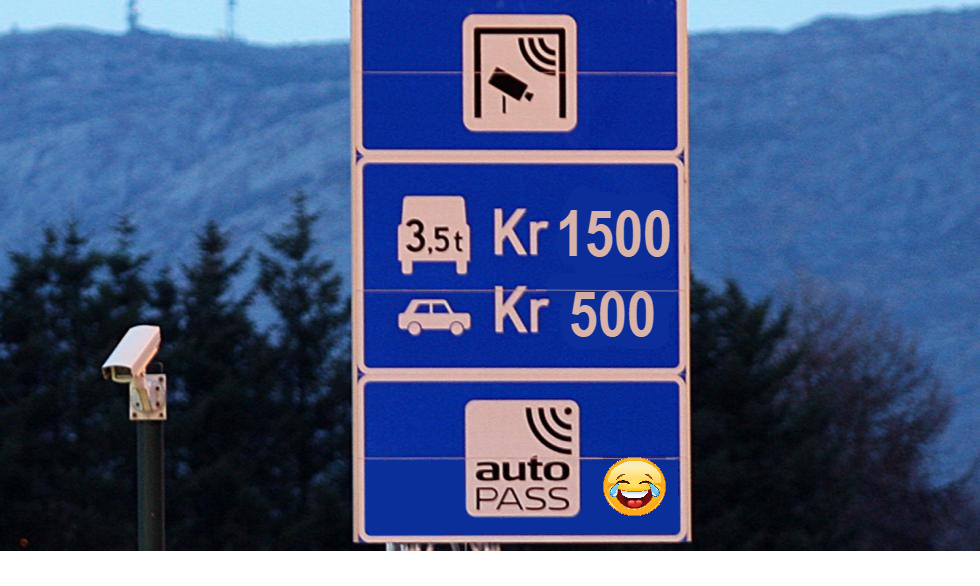
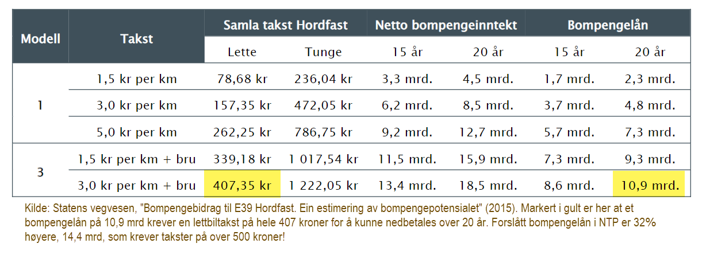
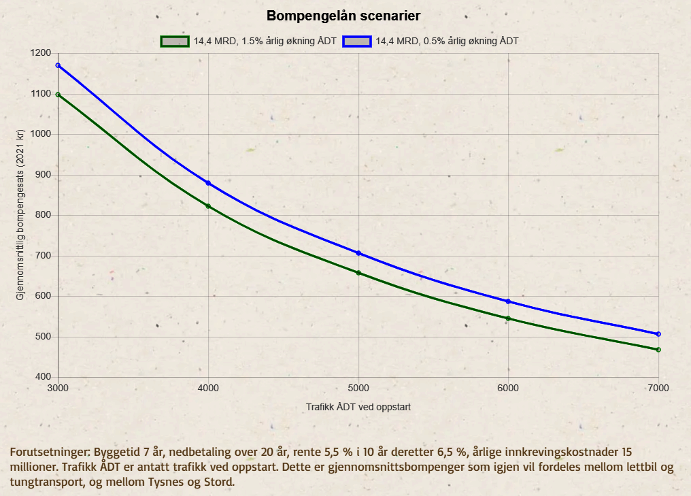

Publisert 21 januar 2023, oppdatert/korrigert 1 mars 2023

Et gjentatt spørsmål i Hordfast er: hva blir bompengene? Dette spør
[Per Fadnes om i Sunnhordland i november 2021](https://www.sunnhordland.no/meiningar/o/Kny6ke/hvorfor-er-det-ingen-som-vil-si-hva-det-vil-koste),
men han får ikke noe svar der. Kanskje ikke så rart, for et ærlig svar er ubehagelig. Et
halvt år senere, i et
[et innlegg i Haugaland Vekst 13 mai 2022](https://haugalandvekst.no/hordfast-er-i-rute/)
hevder sjefen i lobbyselskapet Hordfast AS, Øyvind Halleraker følgende:

> "Taksten vil ligge ca. 10-15% over dagens fergetakst for liten bil. For den viktige
> godstransporten vil det allerede fra dag én bli mye billigere med Hordfast enn med
> ferge. Reisekostnadene vil uansett bortfalle fullstendig så snart prosjektet er
> nedbetalt. Sannsynlig nedbetalingsperiode er stipulert til 15 år, men Hordfast vil
> trolig kunne være nedbetalt et par år før tiden, i likhet med de fleste
> fergeavløsningsprosjekter."

Her er mye feil.
[Retningslinjene til transportetatene](https://web.archive.org/web/20230308010133/https://www.vegvesen.no/globalassets/fag/fokusomrader/nasjonal-transportplan-ntp/transportanalyser/samfunnsokonomiske-analyser/ntp-2022-2033-retningslinjer-for-transportanalyser-og-samfunnsokonomiske-analyser.pdf)
sier at bompengene for fergeavløsnings-prosjekter skal være fergetakst + 40%, pluss et
tillegg på om lag 2-3 kroner per kilometer vei. Og (minst) 20 år er svært sannsynlig,
akkurat som Rogfast og Sotrasambandet, kommer tilbake til det.

Dagens pris for en en lettbil med autopass er 197 kroner med autopass men uten avtale,
mens en elbil (med avtale) slipper unna med 55 kroner. Snakker vi 60 til 255 kroner?
Neppe, hvis vi regner på det, og leser SVV sin egen dokumentasjon!

## Et notat fra Vegvesenet i 2015 angir svært høye bompenger

I
[2015 utarbeidet Vegvesenet et notat](https://archive.org/download/bomfast-kildedokumenter/svv_2015--bompengebidrag_hordfast_estimat.pdf),
der regner de på forskjellige alternativer. Mest interessant er at de finner at takst
for personbil må bli 407 kroner (og 3 ganger så mye for tungbil) for å kunne finansiere
et bompengelån på 10,9 mrd. Men NTP angir et enda høyere bompengelån, nemlig 14,4
milliarder. "Enkelt matte" tilsier da at takstene blir over 500 kroner!

Blir det så gale? La oss se på litt tekniske detaljer. Men obs, litt "nerde-alarm"
her...

## Hvordan virker et bompengelån?

Et veiprosjekt krever en byggetid, og for byggingen kreves kapital (penger). Disse
pengene er vanligvis en kombinasjon av statlige midler og og et bompengelån.
Bompengelånet tas vanligvis opp av eget selskap (bompengeselskap) og Fylkeskommunen (som
fra før har høy gjeldsgrad) er pålagt å være garantist for lånet.

Etter åpning er selve bompengene en nedbetaling av bompengegjelden, både avdrag og
renter, tilsvarende nedbetaling av et boliglån. Mens prosjektet bygges så nedbetales
ikke lånet - det starter først når prosjektet åpner. Låneprofil, rentenivå, "renters
rente" og byggetid er derfor noen viktige faktorer for hvor høyt lånet faktisk er ved
prosjektets åpning.

Totalt vil disse faktorene avgjøre hvor høye bompengene blir:

Hva er den statlige andelen vs. bompengebidraget?

Når i byggeprosessen blir bompengelånet tatt opp? Dersom de statlige midlene kommer sent
så må bompengelånet finansiere byggingen fra første dag. Dette gir en lengre periode med
akkumulering av renter, som i neste omgang gir høyere bompenger

Hvor lang blir byggetiden? Jo lengre byggetid, desto mer vil gjelden til
bompengeselskapet øke før nedbetaling kan starte.

Hvor lang blir nedbetalingstiden? En norm er 15 år, men mange større prosjekter har i
dag 20 år i stedet og noen har opsjon til 25 år (for eks Rogfast). Lengre
bompengeperiode gir lavere bompengeavgift, men gjør samtidig at tiden frem til "gratis
vei" blir forlenget.

Hvilken rente skal man anta, og hvor stor er prisstigningen? Det blir ofte lagt til
grunn at bompengene kan reguleres i takt med den generelle prisstigningen.

Hva er trafikken ved åpningstidspunktet og hvor mye stiger den per år etter åpning?

Hvor stor andel er "tungtrafikk"? En vanlig regel er at tungtrafikken i snitt betaler 2
til 3 ganger det som en vanlig personbil vil betale (uten rabatter).

Hvilke rabatter skal man ha? Skal el-bil betale halv pris, eller 80 %? Skal folk som
pendler regelmessig få rabatt ("avtaler"), og i tilfelle hvor mye rabatt?

Hvor mye skal bompengeselskapet kreve i årlig beløp for å drifte seg selv og
bomstasjonene?

Hvor mange bomstasjoner blir det, og skal gamle traseer og omveier også belastes med
bompenger?

Hva om prosjektet sprekker, skal da både bompengelån og statlig andel øke, eller kun
statlig andel?

Alt i alt blir det fort komplisert, spesielt når man kommer til rabattordninger da disse
er politisk styrt og kan endres på kort varsel. Men det som er et greit mål er at gitt
en antatt trafikkmengde per døgn (ÅDT) samt byggetid, renter, prisstigning og
nedbetalingstid så kan man beregne en gjennomsnittlig bompengetakst. Og dersom noen får
rabatt så må andre betale tilsvarende mer, slik at den gjennomsnittlige taksten blir
oppfylt. Eksempler på slike regnestykker finner man typisk i Stortingsvedtak om
finansiering av veiprosjekter.

## Bompengekalkulator

Trafikkforsker Harald Minken (TØI) laget i forbindelse med
[rapporten om fergefri E39](https://www.toi.no/getfile.php?mmfileid=54362) en
[regneark-basert bompengekalkulator](https://www.toi.no/getfile.php/1333188-1503662066/Publikasjoner/T%C3%98I%20rapporter/2013/1272-2013/Bompengekalkulator.xlsx).
Dette regnearket er utgangspunktet for
[Bomfast sin bompengekalkulator](https://www.bomfast.info/bompengekalkulator) som er
programmert i Javascript
[med åpen kildekode](https://github.com/jcrivenaes/bomfasttools/tree/master/public).
Sammenlignet med Minkens regneark er
[Bomfast sin kalkulator](https://www.bomfast.info/bompengekalkulator) mer avansert,
blant annet:

- Prisstigning er inkludert
- Lånerenten kan variere fremover i tid (2 nivåer)
- Det kan legges inn varianter på når i bygge-prosessen bompengelånet tas opp
- Det er mer avansert med hensyn til fordeling mellom tungtrafikk og lettbiler med
  rabattordning
- Programmet er iterativt; gitt inngangsdata og forventet nedbetalingstid (for eks 15
  år) vil det iterere seg frem til forventet bompengenivå

## Validering

Når man har programmert noe så er det nødvendig med
[verifisering/validering](https://en.wikipedia.org/wiki/Software_verification_and_validation):
Regner det riktig? Gir programmet omtrent samme tall som det Stortingsproporsjonene om
finansiering viser? Her gjelder det å finne dokumentasjon som har tilstrekkelig med
pålitelige inngangsdata og forutsetninger (og det er ikke alltid lett, mange av
Stortingsproporsjonene er mangelfulle!). Det beste er å finne vedtak med få bomstasjoner
og uten at også sideveier også får bompenger (fordi Stortingsproposisjonene da oftest
ikke gir nok opplysninger om trafikkfordeling over tid til å kunne gjenskape tall).
Etter en del leting er følgende brukt til validering:

- Validering mot Minkens regneark. Dette gir meget god overenstemmelse, og vi kommer til
  omtrent samme bomtakster (forskjellen skyldes antagelser på når på året lånet lånet
  tas opp, og hvilke dato som nåverdi (diskontert verdi) skal regnes til.
- [Rogfast](https://www.regjeringen.no/no/dokumenter/prop.-105-s-20162017/id2548124)
  (2016). Stortinget sier gjennomsnittstakst 374 kroner over 20 år, bomfast kalkulator
  gir også 374 kroner (avvik +0 %, ikke verst)
- [Rogfast](https://www.regjeringen.no/contentassets/8e5b283f2fd34f7b8559705ad9d2502b/nn-no/pdfs/prp202020210054000dddpdfs.pdf)
  (2021, nytt vedtak etter sprekk), Stortinget sier gjennomsnittstakst 409 kroner,
  Bomfast kalkulator gir 408 (må også kalles inntertier).
- [Grime-Vesleelva](https://www.regjeringen.no/contentassets/72a5e7fc2d5048a0a4268aa2714301f5/no/pdfs/prp201020110103000dddpdfs.pdf),
  24,5 kroner fra Stortingsproposijon, Bomfast gir 23,6 kroner (nominelt avvik er 0,9
  kroner)
- [Fønhus-Bagn](https://www.regjeringen.no/contentassets/262884fcb4ac4a21a69b1b809bc3dae4/no/pdfs/prp201120120101000dddpdfs.pdf),
  30 kroner i Stortingsproposisjon, Bomfast gir 29,11 kroner (avvik 0,9 kroner)
- [Kilden-Presterødbakken](https://www.regjeringen.no/contentassets/0b1c67e1808d45d29e474abd16125416/no/pdfs/prp201720180103000dddpdfs.pdf),
  13,5 kroner i Stortingsproporsjon, Bomfast gir 13,4 (omtrent innertier)

Basert på disse eksemplene er det grunn til å tro at kalkulatoren er "mer enn rimelig
pålitelig".

Merk forøvrig de høye takstene for Rogfast! Det blir neppe noe lavere for Hordfast
(lavere trafikktall og enda høyere kostnader!)

## Hordfast, hva blir bompengene gitt NTP finansiering?

I NTP 2022-2033 blir angitt en byggekostnad på 37,7 milliarder 2021 kroner, hvorav
bompengeandelen (annen finansiering) skal utgjøre 14,4 milliarder (fergeavløsningsmidler
inngår neppe i "annen finansiering" i særlig grad, da
[tidligere regnestykker](https://tinyurl.com/3kvkfdkd) viser at vedlikeholdskostnadene
ved prosjektet er noe større enn tilskuddet til fergedriften). Etter dette har Hordfast
sin kostnad
[økt til over 41 milliarder](https://www.vegvesen.no/contentassets/ec00a3a5e447428da5f3f3911fe3c217/presentasjon-pressekonferanse-10.-mai-2022-statens-vegvesen-002.pdf),
men vi antar fortsatt her at bompengelånet forblir uendret (rett og slett fordi
bilistene neppe tåler enda høyere bompenger).

Dette neste man trenger er forventet ÅDT og årlig trafikkvekst. SVV opererer med 5700 i
ÅDT i åpningsåret med årlig stigning på (minst?) 1,5% de neste 20 årene (grunnlag for
dette er fra
[side 83 i denne rapporten](https://www.regjeringen.no/contentassets/7cb4217acb094720905ba6c438cd3ab7/svv-vedlegg-1-leveranse-til-sd-endelig.pdf)).
Byggetiden er kanskje angitt til (kun) 5 år, med oppstart 2027. Deretter brukes
"standard renter" på 5,5% første 10 år, deretter 6,5% og en prisstigning på 2,5%. NTP
sier at at den Statlige andelen i hovedsak kommer sent så bompengelånet må da komme
tidlig (noe som gir høyere bompenger). Det er er antatt at bompengeperioden blir (minst)
20 år, basert på Rogfast,
[Sotrasambandet](https://www.stortinget.no/globalassets/pdf/innstillinger/stortinget/2017-2018/inns-201718-270s.pdf)
og
[annen info fra SVV](https://vegvesen.brage.unit.no/vegvesen-xmlui/handle/11250/2981972).
Da før vi følgende gjennomsnittstakst:



Dette svarer en gjennomsnittstakst omtalt i en
[SVV "klima-rapport" fra 2022](https://vegvesen.brage.unit.no/vegvesen-xmlui/handle/11250/2981972)
(som forøvrig har en rekke pinlige regne- og andre tekniske feil, se
[Naturvernforbundet sin motrapport](https://naturvernforbundet.no/content/uploads/sites/13/2022/11/Naturvernforbundets-motrapport-mot-SVV-som-mener-Hordfast-er-et-klimatiltak-300922.pdf))
sier (side 6): "Bompengene blir lik dagens ferjetakster + 40% på strekningen" (som
forøvrig beviser at Hordfast AS opererer med feile tall!). Side 13 i samme rapport sier
at bompengeperioden antas å være 20 år. Men merk her at "dagens ferjetakster" var før
dagens regjering satte ned ferjetakstene.

Bompengenivået ble også omtalt i en BA artikkel fra høsten 2020. Her sies det, sitat:
"Taksten som vegvesenet har levert inn er 362 kroner for lette kjøretøy, dette inkludert
rabatten som autopassbrikke og -avtale gir. Til sammenligning er betalingen på fergen i
dag, inkludert samme rabatt, 267 kroner. Med andre ord er dette i regnestykket en økning
på 36 prosent, sier Olav Svangstu i veivesenet."

Tallene i BA avviker litt fra tall i "endelig NTP rapport" fra SVV; sitat (s. 84):
"Gjennomsnittlig faktisk takst for personbil på ferjesambandet Halhjem – Sandvikvåg er i
dag 272 kr. Ved vurderingen av bompengepotensialet for Ådland – Svegatjørn er det lagt
til grunn en takst for tilsvarende kjøretøyer på 352 kr, en økning på 29 pst". Her er
uklart hvilke rabattordninger som ligger til grunn for "gjennomsnittlig faktisk takst"
(for eksempel hva er takst for elbil?), Men det illustrerer uansett størrelsesorden
350-370 for lett bil med rabatt. Det blir uansett mer en 700 kroner dagen tur/retur
Stord-Os. Skal man videre til Bergen sentrum må man i tillegg betale for
Svegatjørn-Rådal, så bomringen og tilslutt for parkering. Blir fort over 1000 kroner
dagen!

I bomfastkalkulatoren er det mulig å estimere ut hva en bil med rabatt vil koste, men
det antar at man vet noe om låneprofilen, tungtrafikkandel, og hvor stor andel en
lettbilene som vil ha autopassbrikke med rabatt, etc. Sier man at tungtrafikkandelen
blir 13% og må betale 3 ganger lettbil-takst (som i Rogfast), og andel lettbiler som får
rabatt er 70%, samt at rabatten til disse da er 20% så sier kalkulatoren at lettbil med
rabatt vil koste 361 kroner, som jo er svært nær de 362 kronene som angitt i BA
artikkelen. Tungtrafikken må da betale hele 1387 kroner i snitt per tur, så påstanden
til Hordfast AS at "For den viktige godstransporten vil det allerede fra dag én bli mye
billigere med Hordfast enn med ferge" er ren desinformasjon (se dagens fergetakster
nedenfor).

## Noen sensitiviteter

Med kalkulatoren er det lett "å leke med tall", nemlig se hva blir bompengene dersom
forutsetningene endres. Under er noen eksempler:

En byggetid på 5 år for Hordfast er neppe realistisk. Det skal bygges verdens lengste
flytebro og en rekke andre krevende broer og tunneler. Rogfast skulle egentlig også bare
ta 5 år, nå er byggetiden over 10 år. Hva om byggetiden til Hordfast blir minst 7 år? Da
blir gjennomsnittakst:



En årlig trafikkvekst på 1,5% er relativt høyt gitt at trafikken for fergene de siste 7
årene knapt har hatt økning. Hva trafikkøkningen blir 0% i stedet? Beregnet
gjennomsnittstakst blir da



Hordfast AS hevder at bompengeperioden blir 15 år og ikke 20 slik SVV sier i sine egne
rapporter, hva må da gjennomsnittstakst bli da (gitt 7 års byggetid)?



I dag er trafikken over Bjørnafjorden ca. 3200 biler per døgn. En engangsøkning til 5700
"over natten" er ganske mye, spesielt når bompengene er såpass høye. SVV hevder at mye
trafikkøkningen over Bjørnafjorden vil være "omfordelt trafikk", nemlig at Ole & Kari
Bergenser velger å kjøre Stord-Os (med bompenger) i stedet for Bergen-Askøy (gratis).
Hvorfor de skal ønske å gjøre det gitt de høye bompengene forblir et mysterium.

Hva hvis trafikken ikke øker i det hele tatt men er 3200 ved oppstart, og veksten
deretter er kun 0.5% per år (20 år nedbetaling)?



Grafen under (hentet fra [denne siden](https://www.bomfast.info/bompengescenarier))
viser hvordan bompengene varierer, gitt forskjellig ÅDT ved oppstart og forskjellig
trafikkvekst

## Hvis Tysnesingene skal betale mindre, må Stordabuene betale mer

Denne gjennomsnittstaksten gjelder for hele prosjektet. I praksis vil det være slik at
de som skal til Tysnes vil betale mindre, kanskje om lag halvparten. Men om noen skal
betale mindre så må andre (les: Stordabuene) betale mer, for lånet skal nedbetales "okke
som". Det er derfor god grunn til å anta at gjennomsnittstaksten for de som kjører hele
strekningen Os-Stord blir noe høyere enn de 526 kronene som er angitt over.

## Men fergene er nå blitt mye billigere

Som nevnt tidligere er regnestykket basert på tidligere fergetakster, ikke dagens
takster som
[regjereringen har redusert betydelig](https://www.nordnorskdebatt.no/ap-halverer-fergetakstene-frp-sutrer/o/5-124-151605).
[Slår man opp i pristabellen](https://autopassferje.no/priser/) finner man i dag
(januar 2023) følgende priser for Halhjem-Sandvikvåg:

- Lettbil konvensjonell uten autopassbrikke: 219 kroner
- Lettbil konvensjonell med autopassbrikke og 10% rabatt: 197 kroner
- Lettbil konvensjonell med autopassbrikke og avtale, 50% rabatt: 109 kroner
- Lettbil nullutslipp med autopassbrikke og avtale: 55 kroner(!)
- Tungbil (14,5-17,5m) konvensjonell uten brikke og avtale: 953 kroner
- Tungbil (14,5 -17,5m) konvensjonell med autopassbrikke og bedriftsavtale: 572 kroner
- Tungbil (de største, over 22m), fullpris er 1178 kroner, mens med brikke og
  bedriftsavtale blir det 707 kroner

Sammenligner vi dette med
["endelig NTP rapport" fra SVV](https://www.regjeringen.no/contentassets/7cb4217acb094720905ba6c438cd3ab7/svv-vedlegg-1-leveranse-til-sd-endelig.pdf),
sitat (s. 84) "Gjennomsnittlig faktisk takst for personbil på ferjesambandet Halhjem –
Sandvikvåg er i dag 272 kr " så ser vi at dette ikke kan stemme lengre. Hva
"gjennomsnittlig faktisk takst for en en personbil" nå er ikke helt opplagt å si, men
den må være mellom 55 og 219 kroner et sted.

Så prisøkningen ved Hordfast blir betydelig, både for lette og tyngre biler. For å komme
ned i tilsvarende priser + 40% så må Staten øke sin andel ved utbyggingen med mange
milliarder.

Gjeldende veiledning sier at
[bomtaksten skal være ferjetakst + 40 prosent, pluss 2 kroner pr kilometer (personbiler)](https://www.vegvesen.no/globalassets/fag/fokusomrader/nasjonal-transportplan-ntp/transportanalyser/samfunnsokonomiske-analyser/ntp-2022-2033-retningslinjer-for-transportanalyser-og-samfunnsokonomiske-analyser.pdf).
Tar man utgangspunkt i autopasspris (197 kroner) og 55 km, så skal taksten være 386
kroner for lettbil med autopassbrikke.

Nå vil noen påpeke at de reduserte ferjetakstene må også betales av Staten, og det er
riktig. Men ser man på Statsbudsjettet så finner man følgende statlige midler for alle
riksveifergene ("kjøp av riksveiferjetjenester",
[om lag 16 samband](https://www.vegvesen.no/trafikkinformasjon/reiseinformasjon/riksveiferjesamband/);
dessverre er ikke tall per samband gitt offentlig):

- 2018-2019: 1,277 milliarder
- 2020-2021: 1,6 milliarder
- 2021-2022: 2,663 milliarder

Altså et gjennomsnittlig bidrag per fergesamband på ca. 165 millioner per år. De
reduserte fergetakstene gir en netto økning i Statsbudsjettet på ca. 1 milliard, dvs
"kun" 62,5 millioner i gjennomsnitt per samband per år.

## Får de fleste fergeavløsningsprosjekter kortere nedbetalingstid?

Tja noen har fått det, men andre ikke. For eksempel sliter nå
[Hardangerbrua, som trolig må både øke takster og forlenge bompengeperioden](https://direkte.vg.no/nyhetsdognet/news/foreslaar-bompengeoekning-paa-hardangerbrua.lum5Rb6k9).
En faktor som er viktig her er at
[trafikkveksten i Norge har flatet ut](https://www.vegvesen.no/globalassets/fag/trafikk/trafikkdata/vegtrafikkindeksen_2022-09.pdf)
de senere årene.

## Hvor mye må Staten betale av Hordfast dersom gjennomsnittstakst skal bli "kun" 200 kroner?

Det er selvfølgelig mulig at bompengene kan bli lavere. Men da må selvsagt Staten betale
tilsvarende mer. Og det det kan bli mye mer!

Med [bomfastkalkulatoren](https://www.bomfast.info/bompengekalkulator) ser vi at dersom
bompengelånet reduseres fra 14,4 milliarder til om lag 5 milliarder så blir
gjennomsnittlige bompenger om lag 204 kroner (gitt uendret ÅDT). Da er man kanskje i
nærheten av levelige bomtakster. Enkel matte sier da om utbyggingen nå koster minst 41
milliarder, så må Staten totalt bevilge:



Det er altså en økning på om lag 10 milliarder sammenlignet med det som skissert i NTP.
Hvis man studerer samferdselsbudsjettet så ser man at man får mye annet for 10
milliarder! Og vi sier "minst", fordi det er før de
[forventede kostnadssprekkene](https://www.ba.no/hordfast-er-meningslost-og-svindyrt/o/5-8-1817081)...

36 statlige milliarder for investeringer er veldig mye penger i samferdselsbudsjettet.
For 2023 angir
[samferdselsbudsjettet](https://www.regjeringen.no/contentassets/4d488bcc172e4e039dfe9c3b1e563217/no/pdfs/prp202220230001_sddddpdfs.pdf)
totalt ca. 18 milliarder for riksveiinvesteringer for hele landet, inklusiv potten som
Nye Veier får. M.a.o. får Statens Vegvesen ca. 12 milliarder å "rutte med", og mye av
dette går til mindre utbedringer (oppgradering av tunneler for eksempel) over hele
landet.

Vi kan avsluttet med et sitat fra vegdirektør Kjartan Hove i SVV som uttaler
[i et brev forbindelse med E39 Vågsbotn-Klauvaneset (ringveg øst) i Bergen](https://www.vegvesen.no/globalassets/vegprosjekter/utbygging/e16e39arnaklauvaneset/vedlegg/kommunedelplan/20_16800-101-oversendingsbrev.pdf),
sitat fra side 4:

> _"Samtidig vil Statens vegvesen sterkt imøtegå høringsinnspill som hevder at en
> forskjell på rundt 500 mill. kr i investeringskostnader sammenlignet med alternativ S3
> er «småpenger». I tillegg er beregnet forskjell i nettonytte hele 694 millioner
> kroner. Innenfor avgrensede samferdselsmidler og harde prioriteringer i Nasjonal
> transportplan er dette betydelige summer."_

Hvis 0,5 milliarder er "betydelige summer innenfor avgrensede samferdselsmidler og harde
prioriteringer i NTP", Kjartan Hove, hva er da summene i Hordfast?

## Til sist, hva er egentlig kostnad for prosjektet for sluttbruker?

Ved nedbetaling av bompenger så betales en rente som forsvinner til den eller de som gir
lånet (ofte utenlandske banker). Disse pengene utgjør utvilsomt en stor "skjult kostnad"
for sluttbruker, som sjelden eller aldri kommer med i de offisielle regnestykkene.

[Bomfast sin kalkulator](https://www.bomfast.info/bompengekalkulator) kan regne
nåverdien (diskontert verdi) av denne summen, og ved gjeldende offisielle tall (38,5
milliarder totalt, hvorav 14,4 milliarder i bompengelån) så vil rente- og
innkrevingskostnaden utgjøre om lag hele 12,7 milliarder (diskontert til 2021 kroner),
altså er den reelle kostnaden for sluttbruker er ikke 38,5 milliarder, men 51,2
milliarder!

## Konklusjon

Gitt at bompengelånet for Hordfast blir 14,4 milliarder kroner slik NTP 2022-2033 angir,
så må gjennomsnittstakstene være i størrelsesorden minst 500 -700 kroner for at
bompengelånet skal kunne nedbetales innen 20 år.
