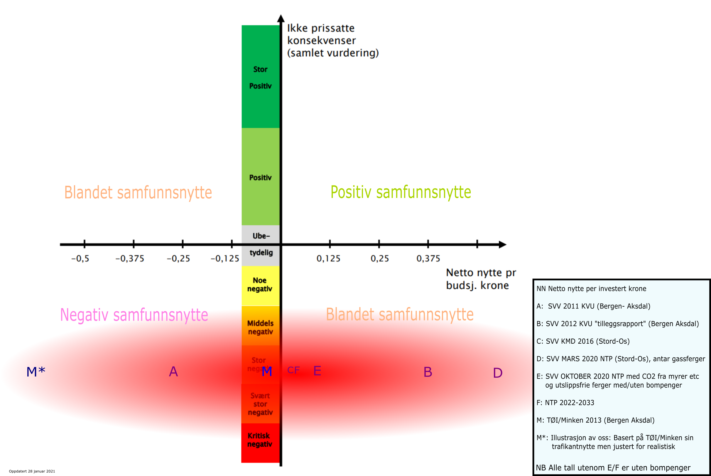
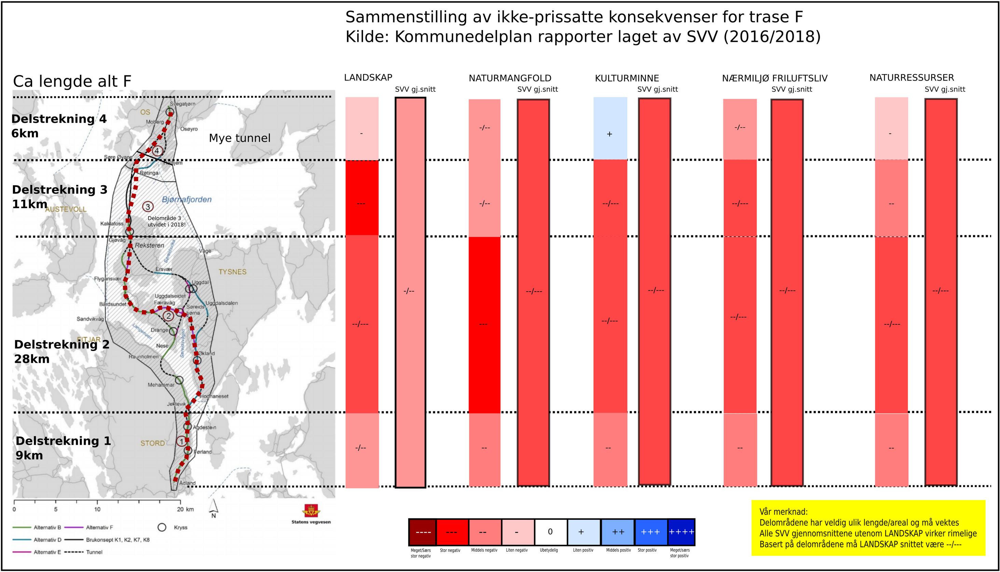
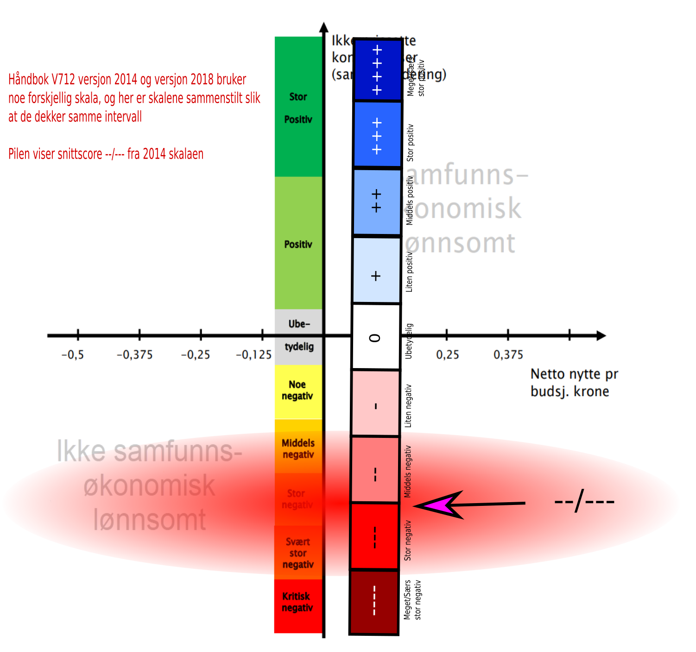

Er Hordfast virkelig samfunnsøkonomisk lønnsom når man sammenstiller den prissatte
"nytten" med de ikke-prissatte virkningene, som tap av unikt naturmangfold? Svaret er
nei!

. Ny NTP kommer vår 2024.')

## Innledning

En gjentatt feil er at man setter likhet mellom "prissatt nytte" og "samfunnsøkonomisk
lønnsomhet" i veiprosjekter som Hordfast. At feilen kommer fra lobbyister som Hordfast
AS er ikke mer enn man kan forvente. Men at det kommer fra Statens Vegvesen (SVV) og fra
Departementene selv er skremmende. Se for eksempel
[her](https://www.veier24.no/artikler/vil-endre-samferdselen-pa-vestlandet-for-alltid/461284)
og
[her](https://www.bt.no/nyheter/innenriks/i/2Geeqq/vegvesenet-prioriterer-hordfast-fremfor-e16).

I Bergensavisen 14 april 2020 kommer Kjartan Hove fra Statens Vegvesen med et
[motsvar](svv_khove--2020_samfunnsnytte_ba_14april.pdf) til
[Jørund Vandvik sitt debattinnlegg](https://www.ba.no/liv-helse-og-miljo-ma-komma-forst/o/5-8-1270970),
hvor han hevder at "Jo, Hordfast er samfunnsøkonomisk lønnsom". Her har han
tilsynelatende glemt alt som står i egne håndbøker.

SVV har nemlig en fin håndbok som heter
[V712 - Konsekvensanalyser](https://archive.org/download/bomfast-kildedokumenter/hb-v712-konsekvensanalyser_2018.pdf).
Denne er ganske omfattende (267 sider i 2018 utgaven) på hvordan konsekvensanalyser skal
gjennomføres, og ikke minst, hvordan de skal presenteres.

Her et er utvalg av viktige sitater fra denne håndboken (2018 utgaven):

1. I alle prosjekter gjøres det en sammenstilling av prissatte og ikke-prissatte
   konsekvenser med en samlet vurdering av fordeler og ulemper og rangering av
   alternativer (side 199)
2. Viktige krav til sammenstillingen, som til resten av analysen, er etterprøvbarhet og
   formidling. (s 199)
3. Et prosjekt er samfunnsøkonomisk lønnsomt når summen av prissatte og ikke-prissatte
   fordeler er større enn summen av prissatte og ikke-prissatte kostnader (ulemper)...
   (s. 200)
4. Vurder usikkerhet i analysen. Når samlet rangering basert på forventningsverdier er
   gjennomført, vurderes det om usikkerhet i analysene kan tilsi endret rangering.
   (s. 201)
5. Det foreligger foreløpig ikke en omforent metode for å beregne ulike former for netto
   ringvirkninger. Selv om slike virkninger beregnes i en del prosjekter, inngår de
   derfor ikke i den ordinære samfunnsøkonomiske analysen. (s. 219)

Siden man skal sammenstille noe som har tallverdi med noe som ikke har tallverdi, sier
det seg selv at et vegprosjekt sin samfunnsøkonomiske lønnsomhet ikke kan angis med
tall, men kun en overordnet kvaliatativ vurdering som faller i kategoriene "positiv",
"blandet/usikker" eller "negativ".

## Prissatt "nytte" i Hordfast

Et viktig tall i denne sammenhengen er "netto nytte per investert krone" (NN). Grovt
sett er dette tallet dominert av 3 faktorer: Forventet trafikkantnytte (T), pris på
bygging (I) og vedlikehold (V). Dette skal så settes opp diskontert som en
nåverdibetraktning over et visst antall år med en viss rente (typisk 4% rente over 40
år). Noe(?) forenklet kan man si:

```text
NNK = (T - (I + V)) / (I + V)
```

NNK er definert som netto nytte fra prosjektet (sum positive og negative virkninger
inkl. investering) delt på summen av investering og endring i drifts-og
vedlikeholdskostnader inklusive mva. Grunnen til at tallet under brøkstreken er inkl.
mva at investeringsbudsjetter oppgis inklusiv mva. Brøken skal si noe om den relative
lønnsomheten av et prosjekt, uavhengig av om finansieringen kommer fra staten, bompenger
eller annet, altså hvor mye samfunnet får tilbake i økt samfunnsnytte pr. krone som
samfunnet som helhet bruker på tiltaket.

Opp gjennom tidene har ofte NNB vært brukt (netto nytte per statlig budsjettkrone), men
NNB er diffust når varierende bompengeandel er med i bildet. Nyeste NTP bruker nå NNK
konsekvent. Hvis det er usikkerhet i hva som er brukt i rapportene brukes bare "NN"

Opp gjennom årene har det kommet mange tall på prissatt nytte (NNK/NNB) på Hordfast (men
merk at ofte er det NNB som er angitt). I motsetning
[til hva SVV selv hevder (versjon fra 2021, arkivert)](https://web.archive.org/web/20210726044827/https://www.vegvesen.no/vegprosjekter/europaveg/e39stordos/ofte-stilte-sporsmal/),
så har disse
[svingt fra negativ lønnsomhet til positiv](https://www.nrk.no/vestland/ekspertane-kranglar-om-kor-nyttig-hordfast-blir-1.12864739),
alt etter forutsetninger. Tallene er imidlertid ikke helt rett frem sammenlignbare, da
både lengde på prosjektet og forutsetninger som veistandard, merverdiavgift,
diskonteringsrente og antall år har variert sterkt. De fleste tall er også beregnet uten
bompenger, noe som naturlig nok
[kan utgjøre en stor forskjell](https://www.nrk.no/vestland/_-vegvesenet-feilvurderer-nytten-av-vegprosjekt-1.13262879).
Med høye bompenger så senkes "trafikantnytten" betydelig.

Her er noen eksempler:

- [KVU 2011](https://web.archive.org/web/20220522132631/https://www.vegvesen.no/vegprosjekter/europaveg/e39stordos/planar-og-dokument/kvu/):
  Midtre trase (4C) negativ NN: -0.25. Strekningen det er ble beregnet for er
  Aksdal-Bergen (Aksdal er nær Haugesund, o.a.), og det ble her hevdet at det hele ville
  koste 19,3 milliarder (inklusiv bro over Bjørnafjorden!). I dag er samme strekning
  estimert til svimlende 60 milliarder kroner dersom motorveistandard til Haugesund! Og
  minst 70 milliarder dersom motorvei helt til Bokn, for å koble mot Rogfast.
- [KVU 2012 "tilleggsrapport"](https://www.regjeringen.no/globalassets/upload/sd/vedlegg/kvu-rapporter/tilleggsutgr2012.pdf):
  I løpet av ett år er NN snudd fra -0.25 til +0.38! Trafikkantnytten (T) er endret fra
  14 milliarder til 41 milliarder bare ved å justere på forutsetninger, programversjon
  og regnemetode. Litt av et hallingkast!
- [TØI 2013 v/ Harald Minken](https://www.toi.no/getfile.php/1333439/Publikasjoner/T%C3%98I%20rapporter/2013/1272-2013/1272-2013-elektronisk.pdf).
  Harald Minken er en
  [anerkjent fagperson](https://www.toi.no/ansatte/minken-harald-article4585-202.html)
  med mange publikasjoner bak seg. Han tok utgangspunkt i strekningen Aksdal-Bergen (med
  anslag 28 milliarder) og anslo trafikkantnytten til ca 27 milliarder (40 år, 4% rente)
  som er betydelig under SVV sine tall. Det gir en NN på -0.06. Bruker man i stedet
  dagens pris på ca 60 milliarder for investering Bergen Aksdal men beholder samme
  trafikantnytte som blir NN ca. -0.7, altså en svært negativ prissatt nytte. Og dette
  fremdeles uten bompenger som vil gjøre det enda verre.
- [KDP 2016](https://archive.org/download/bomfast-kildedokumenter/svv_2016--kommunedelplan_hovedrapport.pdf):
  Her er enda høyere trafikantnytte enn i 2012 (48 milliarder), men prisen på
  investering har også økt betydelig. NN (NNB?) blir derfor +0.04 (nær null).
- [Innspill til NTP](https://www.regjeringen.no/contentassets/13a80858d58a47e1a23e944b7144ee9b/2020-03-26-oppdrag-9-til-sd-korrigert-versjon.pdf):
  Her er tallet 0.58 brukt i netto nytte. Siden 2018 har tall har netto nytte svingt fra
  0.41 til 0.79, nå tilbake på 0.58. Men fremdeles (som nevnt over) uten bompenger som
  kan
  [redusere den prissatte samfunnsnytten betydelig](https://samferdsel.toi.no/forskning/bompenger-kan-gi-betydelig-reduksjon-i-brukernytten-article33479-2205.html).
- [Innspill til NTP høsten 2021](https://www.regjeringen.no/contentassets/5a0bb3ce451a491f9648322a33f19bff/klimaeffekt-av-virksomhetenes-prioriterte-prosjekter-i-ntp-2022-2033-web.pdf).
  SVV ble nødt til å regne med utslipp fra arealinngrep (myrer blant annet) og at
  fergene blir utslippsfri
  ([noe som er veldig sannsynlig](https://energiogklima.no/nyhet/gronn-skipsfart/gronnskipsfart-naermere-60-elektriske-bilferger-innen-2021/)).
  Og bompenger (trolig). Da sank nytten (NNB?) til ca 0.1! En liten budsjettsprekk, og
  også den prissatte nytten blir negativ...
- I
  [NTP 2022-2033](https://www.regjeringen.no/contentassets/fab417af0b8e4b5694591450f7dc6969/no/pdfs/stm202020210020000dddpdfs.pdf)
  så er kostnad for prosjektet 37,7 mrd. kroner og netto nytte 1,8 mrd. kroner. Legger
  man til vedlikehold så blir NNK ca 0.04. Oversatt: nesten null. Merk at her har man
  gått over
  [fra 40 års beregningsgtid til 75 år](https://www.tu.no/artikler/store-veiprosjekter-ble-mer-lonnsomme-over-natta-okte-levetiden-fra-40-til-75-ar/511504).
  Dette grepet øker den tilsynelatende samfunnsnytten med rundt 20 milliarder (basert på
  tall angitt i
  [denne rapporten](https://www.vegvesen.no/globalassets/vegprosjekter/utbygging/e39stordos/vedlegg/kommunedelplan-med-ku/fagrapportar---ku/e39-stord-os-ku-transport-og-nyttekostanalyse-1-0.pdf)).
  Mao, hadde man regnet på "gamlemåten" ville prissatt samfunnsnytte i NTP være ca -18
  milliarder!
- I mai 2021 ble prisen oppjustert ytterligere, med nytt
  ["styringsmål" på 38,5 milliarder](https://www.tungt.no/article/view/793815/e39_hordfast_38472_millioner)
  (2021) kroner. Bruker man samme nyttetall som regnestykket i NTP vil da NNK reduseres
  til 0,02. Nærmere null er det knapt mulig å komme! Og hvis man hadde brukt den
  tradisjonelle beregningstiden på 40 år ville NN nå være omlag -0,45.
- I innspill til NTP (2025-2033) prosessen høsten 2023 har SVV regnet på nytt, samt gitt
  en samlet "score". Den prissatte nytten har nå røde tall, og den ikke-prissatte er
  "stor negativ" (velkommen etter...) som gir en samlet vurdering som Ikke
  samfunnsøkonomisk lønnsom!

Den store usikkerheten i dette regnestykke er faktisk "trafikkantnytte" (T), selv om det
ofte blir fremstilt at det er byggekostnaden som er mest usikker (og ja den er svært
usikker også;
[Rogfast har jo sprukket før oppstart og ble derfor utsatt](https://www.abcnyheter.no/nyheter/norge/2019/11/09/195625339/rogfast-utsatt-pa-ubestemt-tid)!).
SVV regner seg på "robusthet" i innspill til NTP og sier at dersom trafikken ikke vokser
med 1,5% per år etter åpning men blir konstant 5700 ÅDT, så senkes trafikkantnytten med
hele 9 milliarder
([se side 83 i denne lenken](https://www.regjeringen.no/contentassets/7cb4217acb094720905ba6c438cd3ab7/svv-vedlegg-1-leveranse-til-sd-endelig.pdf)).

Merk også at "trafikantnytte" i dette prosjektet mye knyttet til økt trafikk og
langpendling. Om samfunnet virkelig ønsker mer langpendling, kraftig økt trafikk og
flere biler inn mot de de store byene er en diskusjon i seg selv.

I tillegg er det kommet rapporter fra blant annet SNF/NHH, Vista analyse, Cowi og Menon
på såkalt "mernytte/ringvirkninger".
[Disse spriker i alle retninger](https://uia.brage.unit.no/uia-xmlui/handle/11250/2561960),
blant annet viste SNF sin analyse 400 ganger så mye "mernytte" en Vista Analyse sine
tall. Menon analysen, som ble bestilt av lobbyselskapet Hordfast og som Kjartan Hove
referer, innrømmer også stor usikkerhet.
[TØI's Harald Minken var allerede i 2013](https://www.toi.no/getfile.php/1333439/Publikasjoner/T%C3%98I%20rapporter/2013/1272-2013/1272-2013-elektronisk.pdf)
og senere
[i 2016](https://www.nrk.no/vestland/ekspertane-kranglar-om-kor-nyttig-hordfast-blir-1.12864739)
svært kritisk til disse "mernytte" rapportene, og han konkluderte: "Tatt i betraktning
befolkningstettheten og geografien på Vestlandet er det usannsynlig, både teoretisk og
empirisk, at mernytte gjør ferjefri E39 til et meget lønnsomt prosjekt."

I
[et innlegg i Stavanger Aftenblad 16 jaunuar 2021](https://www.aftenbladet.no/meninger/debatt/i/M36eXR/vegprosjekter-og-lokal-verdiskapning),
viser også forskere at netto ringvirkninger er høyst variable og usikre, og konkluderer
med at "Bedre infrastruktur snur ikke utviklingen i distriktene, men kan forsterke
veksten i og rundt byene." Se også
[denne rapporten](https://www.ntnu.no/documents/1261860271/1262010703/Vegprosjekter%2C+verdiskaping+og+lokale+m%C3%A5l_med+omslag+NY.pdf/2bb8163e-a39f-02a3-e2ec-cc86ffe31cd2?t=1608199496270).

Men! Som håndbok V712 sier (ref punkt 5 over) så skal disse "ringvirkning" analysene
ikke brukes i samfunnsøkonomisk analyse! Hvorfor i all verden bruker da Hove likevel
Menon tallene i sitt avisinnlegg? Hvorfor opptrer
[SVV som en lobbyist](https://www.nordlandsforskning.no/sites/default/files/files/NF-rapport%2008_2018.pdf)?

Det kan tilslutt nevnes at ingen av disse "mernytte" rapportene omtaler ikke-prissatte
verdier som naturmangfold, kulturminner, og landskapsbilde. Er ikke
[det å bevare natur også samfunnsnytte eller mernytte](https://www.bt.no/btmeninger/debatt/i/50qJaO/samfunnsnytte-kan-ogsaa-bety-aa-bevare-natur)?

## Ikke-prissatte konsekvenser

Hordfast lyser rødt på samtlige ikke-prissatte konsekvenser, selv om vi mener at SVV har
gjort sitt beste for å tone dette ned. Fylkesmannen (Statsforvalteren) omtalte det i sin
høring i 2016 som
["det største naturinngrepet i Hordaland i moderne tid"](https://www.nrk.no/vestland/fylkesmannen-slaktar-hordfast-plan-1.13339064),
og spesielt er fokus på unike og internasjonalt sjeldne lokaliteter av kystregnskog. I
innspill til reguleringsplan i 2021
[forsterker Statsforvalteren dette ytterligere](https://www.ba.no/hordfast-statsforvalteren-vil-kutte-farten-og-skjerme-naturen/s/5-8-1791602)
og sier rett ut at prosjektet ligger soleklart innenfor innsigelse (men kan ikke fremme
innsigelse dessverre da dette er "statlig plan").

Departementet skrev selv i sitt
[vedtak i 2019](https://www.vegvesen.no/_attachment/2795510/binary/1341673?fast_title=Vedtak+av+statlig+kommunedelplan+for+E39+Stord%E2%80%93Os.pdf):
"Ny E39 på strekningen Stord-Os vil føre til store inngrep i urørt natur. Særlig gjelder
dette på Tysnes, hvor traséen på store deler av strekningen er lagt gjennom ubebygde
områder. På øya Reksteren er det en rekke forekomster av den truete naturtypen
kystregnskog. Særlig rundt Bårdsundet er tettheten av regnskogforekomster stor.
Kystregnskog er en trua naturtype (VU). E39 Stord-Os vil gå gjennom kjerneområdet for
denne naturtypen i Norge og verden, og også flere andre strekninger av E39 berører
kystregnskog. Disse spesielle regnskogene på Vestlandet utgjør en stor del av den
europeiske utbredelsen av slike skogtyper. Det gir Norge et spesielt ansvar for å ta
vare på de. Også andre steder på Tysnes er det viktige naturverdier, både kystmyr og en
rekke registrerte rødlistearter."

Så om en samlet vurdering av ikke-prissatte konsekvenser skal lande på "stor negativ",
"svært stor negativ" eller "kritisk stor negativ" kan sikkert diskuteres. Etter vårt syn
er dette nærmere "kritisk stor negativ", siden
[myndighetene selv påpeker at Norge har et spesielt internasjonalt ansvar for å ta vare på kystregnskogen](https://tema.miljodirektoratet.no/no/Nyheter/Nyheter/2018/Mars-2018/Unike-regnskoger-kartlagt-flere-steder-pa-Vestlandet/).
Dette kombinert med at miljøvernministeren sier vi trenger en
[egen Parisavtale for nettopp å stoppe mer tap av naturmangfold](https://www.bevar-baardsund.org/post/rotevatn-skrinlegg-hordfast).

Slikt sett er det ingen tvil om at dette alene gjør at Hordfast umulig kan ha "positiv
samfunnsnytte" når man bruker en samlet vurdering av ikke-prissatte og prissatte
konsekvenser.

## Sammenstilling

Siden SVV har "glemt" den samfunnsøkonomiske sammenstillingen for Hordfast mot så gjør
vi et forsøk her. Diagrammet finnes i nevnte
[V712 (2018 versjon)](https://archive.org/download/bomfast-kildedokumenter/hb-v712-konsekvensanalyser_2018.pdf)
(side 201).

Plottingen av ikke-prissatte konsekvenser er gjort basert beskrivelse fra SVV sine
[egne dokumenter](https://archive.org/download/bomfast-kildedokumenter/e39-stord-os-ku-naturmangfold-hoyringsrapport-juni-2016.pdf),
[NTP innspill](https://www.regjeringen.no/contentassets/13a80858d58a47e1a23e944b7144ee9b/2020-03-26-oppdrag-9-til-sd-korrigert-versjon.pdf)
mars 2020 (side 108) og beskrivelser fra
[Fylkesmannen sin høring](https://www.nrk.no/vestland/fylkesmannen-slaktar-hordfast-plan-1.13339064).

SVV vil sikkert være uenig i nivået (siden "landskapsbilde blir midlet inn og det er -
merkelig nok - vurdert som relativt lavt konsekvens på Tysnes, se vedlegg under). Men at
det samlet kommer godt under streken er udiskutabelt!

Som allerede påpekt, så er det komplett umulig at Hordfast noen gang kan komme ut med
positiv samfunnsnytte (vurdert mot nullalternativet, som er fortsatt ferjedrift).

Hvis SVV skulle ha rett i positiv trafikantnytte så er samfunnsnytten "blandet". Men
hvor realistisk er det? På bakgrunn av:

- Stor usikkerhet i "trafikantnytte", ref Harald Minken sitt anslag.
- Svært stor fare for at
  [kostnadene sprekker slik som Rogfast prosjektet](/innsikt/rogfast)
- Siste NTP tall har nær null i prissatt nytte. Disse tallene er basert på ÅDT på 5700 i
  2031(?) og en årlig trafikkvekst på 1,5%, noe som høres usannsynlig ut gitt dagens
  trafikk.

så må den endelige anslaget vårt bli: negativ samfunnsnytte.

Oppdatering vinteren 2024: Nå er Statens Vegvesen enige!



Samtidig, siden ikke-prissatte konsekvenser er "farlig nær" kritisk negativ (spesielt
naturmangfold), burde vel dette alene være nok til å stanse prosjektet?

## Tror SVV og myndighetene på sine egne nytte tall?

I kommunedelsplanen i 2016 (KMD) så vi to forskjellige og motstridende argumenter til
SVV: Den ene var den gjentatte lobbyismen om at dette prosjektet har så stor (prissatt)
samfunnsnytte, det andre var at det var viktig å byggekostnadene ned fordi "prosjektet
er så dyrt". Som et ledd i det siste jobbet SVV systematisk for å gjøre byggingen over
Tysnes så billig som mulig, og det ble knapt gjort noe som helst forsøk på å
unngå/avbøte inngrep i sårbar natur.

Mest tydelig ble dette belyst vedrørende Bårdsundet. Her jobbet SVV knallhardt for å
overbevise beslutningstaker (Staten) om at en (avbøtende) senketunnel i Bårdsundet ikke
"er verdt det", til tross for at både Fylkesmannen, Fylkeskommunen og brukere anbefalte
det i sine høringer på bakgrunn av naturverdier, kulturminner og fritidsverdier.
Ekstrakostnaden var beregnet til 0.9 milliarder, uten optimalisering, som er under 2% av
den direkte trafikantnytten de hevder de forventer. For hvis de mener at samfunnsnytten
er så stor, så har man god råd til tiltak som bedrer den ikke-prissatte nytten, ikke
sant?

[SVV lyktes med å hindre senketunnel](https://web.archive.org/web/20230612225754/https://www.vegvesen.no/globalassets/vegprosjekter/utbygging/e39stordos/vedlegg/vedtak-kommunedelplan-e39-stord-os.pdf),
og da er det bevist at hverken SVV eller Staten egentlig tror på sine egne samfunnsnytte
tall. Så kanskje like greit å gi saksbehandlerne i Hordfastavdelingen noe annet å gjøre,
for eksempel jobbe med
[rassikring og etterslep på vedlikehold](https://www.nrk.no/norge/mangler-milliarder-_-veiene-forfaller-1.14184032)
på Vestlandsveiene? Her er mer enn nok å gripe fatt i!

## Vedlegg1

Sammenstilling av ikke-prissatte konsekvenser basert på SVV sine rapporter alene. Basert
på verdisetting i delområdene, er vi uenige i snittverdien til SVV for LANDSKAP.

Lokalt opptrer også "Meget/særs stor konsekvens", for eksempel for kulturminnemiljøet i
Bårdsundet. Dette "drukner i sammenhengen". Merk også at delstrekning 2 er mye større
enn de andre delområdene, noe som må vektes inn.



## Vedlegg 2

Vår "oversettelse" av skala i Håndbok V712 versjon 2014 mot versjon 2018.
Kommunedelplanen til SVV brukte 2014 utgaven mens hovedplottet i dette innlegget er tatt
fra 2018 utgaven.


