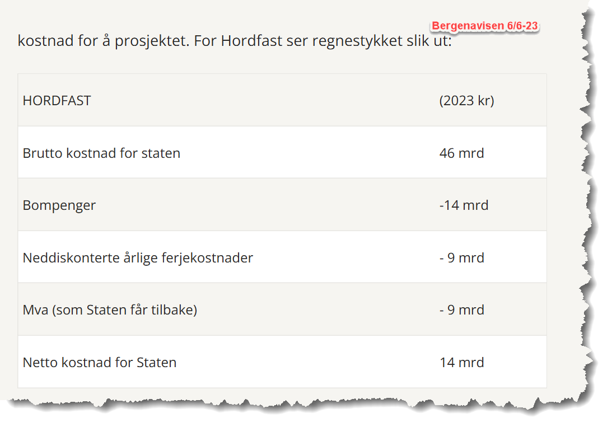
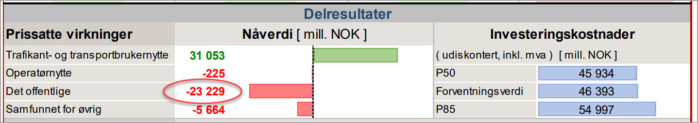
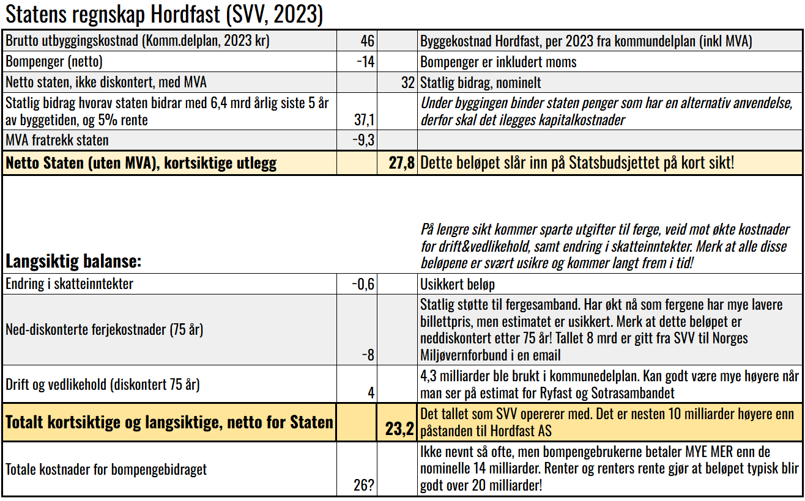
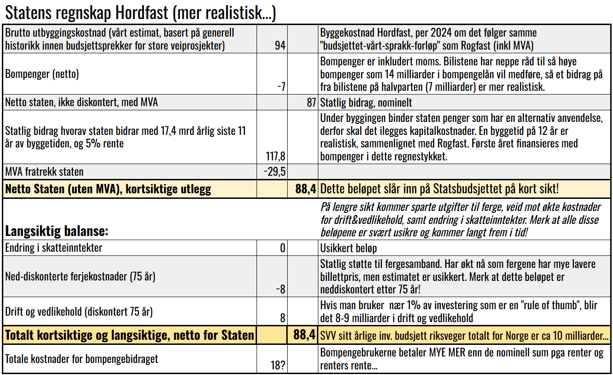

Pådriverselskapet Hordfast AS har de siste årene påstått at Hordfast koster "bare" 14
milliarder for staten. Men Statens vegvesen (SVV) opererer med et tall som 10-14
milliarder høyere. Selv mener jeg at inngangsdataene i SVV sitt regnestykke er
urealistiske, og argumenterer her for at prosjektet mer sannsynlig vil koste staten
rundt 88 milliarder.

## Innledning

I en rekke innlegg de siste årene hevder pådriver/lobbyselskapet Hordfast at "Ja selv om
prisen på Hordfast er 46 milliarder, så er nettokostnaden for staten kun på 14
milliarder". Dette flaue regnestykket blir videre brukt av politikere tilsynelatende
helt uten kritisk sans, spesielt fra Høyre.

Eksempler på innlegg der denne påstanden kommer:

- [I et innlegg i Bergensavisen fra juni 2023](https://www.ba.no/jo-marhaug-vi-forteller-sannheten/o/5-8-2275534)
  (Halleraker). Her kommer også et oppsett på dette regnestykket, se vedlagt figur
  nedenfor.
- [I et innlegg på Høyre sin hjemmeside](https://hoyre.no/vestland/aktuelt/utan-hordfast-splitter-vi-vestlandet-i-to/)
  fra valgkampen (Kleppe og Bjørkly), sist oppdatert april 2024. Det var også et
  lignende innlegg
  [i Sunnhordland](https://www.sunnhordland.no/meiningar/i/O80EQb/utan-hordfast-splitter-vi-vestlandet-i-to).
- [I et innlegg i Teknisk Ukeblad fra januar 2024](https://www.tu.no/artikler/bt-hordfast-utsettes-i-ntp-en-katastrofe/544801)
  (Eskeland).

Her er regnestykket til Hordfast AS, klippet fra innlegget i Bergenavisen:

I forbindelse med NTP-prosessen laget Statens vegvesen
[såkalte supersider](https://www.regjeringen.no/contentassets/f517f097ff11468fbb8087f6bc981c43/svv/statens-vegvesen-vedlegg-rettetversjon190423.pdf),
der de oppsummerer noen av prosjektene de spiller inn. Og gjett hva, også SVV kommer her
med et regnestykke på hva Hordfast koster for "det offentlige", altså staten:

Men de kommer til en helt annen sum for det offentlige budsjettet, nemlig 23,2
milliarder. Så hvem regner riktig, SVV eller lobbyselskapet?

Merk at dette er basert på en tidlig versjon av disse supersidene, i
[senere versjoner er utgiften for det offentlige justert ytterligere opp til 25 milliarder](https://www.regjeringen.no/contentassets/9280e2181cd2495e940c7fdab4293d6f/svv/statens-vegvesen-vedlegg-3-supersider.pdf)
(2024-kroner). Men jeg bruker første tallet her da det er under antagelsen at
byggekostnaden er 46 milliarder 2023-kroner, samme som regnestykket vi finner i
Bergensavisen.

## Hvem regner riktig?

Svaret er egentlig opplagt; SVV vet selvsagt hvordan slike regnestykker skal settes opp
(og da snakker jeg om oppsett; jeg stiller spørsmål til om inngangsdata er realistiske,
og kommer tilbake til det nedenfor).

I kommunedelplan til Hordfast i 2016 foreligger det
[en egen rapport med et detaljert regnestykke](https://www.vegvesen.no/globalassets/vegprosjekter/europavei/e39stordos/vedlegg/kommunedelplan-med-ku/fagrapportar---ku/e39-stord-os-ku-transport-og-nyttekostanalyse-1-0.pdf?v=499072),
med gode forklaringer på oppsettet. Det er dessverre tydelig at Hordfast AS (eller
sentrale folk i Initiativ Vest som trolig er "hjernen" bak dette regnestykket) ikke har
lest dette. For eksempel fra side 43:

> Investeringar slik dei kjem fram i resultata frå EFFEKT, er diskonterte kostnader utan
> meirverdiavgift. Diskonteringa skjer ved at investeringskostnaden blir fordelt jamt ut
> i anleggsperioden som er definert, og så blir det berekna ein renteutgift lik
> kalkulasjonsrenta. Dei skil seg difor frå dei kostnadene som vanlegvis blir gjevne for
> prosjekt.

Oppsummert, det Hordfast AS regnestykket har "glemt" er vesentlig to ting:

1. Ja, det er riktig at statens bidrag skal være uten MVA, men man kan ikke bruke
   nettobeløpet, som angitt i sitatet over. Fordi pengene som staten bruker under
   bygging er bundet, skal de tilordnes en kapitalkostnad og forrentes. Det gjør at det
   statlige beløpet øker, og jo lengre byggetiden er jo dyrere blir det!
2. Hordfast AS bruker 9 milliarder i neddiskonterte årlige fergekostnader som staten vil
   spare, men "glemte" å nevne at dette vil motvirkes av betydelig økte kostnader til
   drift og vedlikehold.

Apropos MVA – det er noe som gjelder alle veiprosjekter. Det er ikke en reell
"innsparing" som bare gjelder Hordfast. Hvis samferdselsbudsjettet dropper Hordfast, så
gir det rom for en rekke andre prosjekter til samme totalsum som også skal fratrekkes
MVA. For statlige finanser er resultatet det samme.

Tilbake til drift og vedlikehold - tror noen virkelig at en 55 km fire-felts motorvei
med 8 km broer og 16 kilometer tunnel i krevende vestlandsvær ikke gir vesentlig økte
vedlikeholdskostnader?

I kommunedelplan er neddiskonterte vedlikeholdskostnader beregnet til 4,2 milliarder
over 40 år. Nå skal det brukes 75 år (ikke 40), så teknisk sett burde det gi en del
høyere tall, men det virker som SVV kun har brukt 4 milliarder. I kommunedelplanen sa
SVV selv at de mente at økte utgifter til drift og vedlikehold ville overgå
fergekostnadene!

Så hvordan blir regnestykket da? I det følgende har jeg skissert oppsettet som gir det
tallet som SVV opererer med. Hva SVV har brukt eksakt er ukjent, men regnestykket jeg
viser er neppe "mye feil". Konklusjonen uansett er at regnestykket til Hordfast AS er
helt feil!

Merk også at regnskapet med neddiskonterte tall for fergekostnader og drift/vedlikehold
er langsiktige og usikre (beregnet over 75 år; vi vet ikke engang om verden vi har i dag
vil være den samme så langt frem). De kortsiktige utleggene for staten er mer sikre, og
da er den nær 28 milliarder for staten, altså det dobbelte av hva Hordfast AS sier.

Til sist kan
[denne artige videoen nevnes](https://www.facebook.com/roald.kvamme.9/videos/846229777323006),
blant annet spør Norges Miljøvernforbund om Statens vegvesen kan gå god for regnestykket
til Hordfast AS (ca 3:54 ut i filmen). De svarer da:

> Statens vegvesen kjenner ikke til tallet som Hordfast AS opererer med

## Men er inndataene til SVV realistiske?

Som jeg viser
[i dette blogginnlegget, så sprekker kostnadene til store vegprosjekter](../store-kostnadsprekker-i-veiprosjekter-er-regelen-ikke-unntaket/)
så det synger. Spesielt er kostnadene ved KVU og kommunedelplan gjennomgående altfor
lave. Hordfast sitt kostnadsestimat (per vinter 2025) er fortsatt basert på
kommunedelplanen, men er justert på prisstigning innen byggebransjen. Per 2024 er
styringsrammen for Hordfast ca 50 milliarder i følge SVV. Kostnadsrammen er ca 60
milliarder.

I [analysen om søsterprosjektet Rogfast](../rogfast/) ser vi at der har kostnadene nær
blitt fordoblet siden kommunedelplan (og da er prisstigning kompensert). Det samme
[gjelder Sotrasambandet](../store-kostnadsprekker-i-veiprosjekter-er-regelen-ikke-unntaket/),
som har en del likheter med Hordfast (blanding av vei, stor bro og tunneler, men med
kjent teknologi i motsetning til Hordfast). Skjer det samme med Hordfast som med Rogfast
og Sotrasambandet, kan vi si at den virkelige kostnaden blir 94 milliarder. Minst!

I [analysen av bompengebidraget](../hordfast-hva-blir-bompengene/), så ser vi at et
bompengelån på 14-15 milliarder vil kreve (minst) godt over 500 kroner i
gjennomsnittbompenger, og trolig en del mer om byggetiden forlenges. Det er svært
tvilsomt om bilistene vil akseptere så høye bompenger, så hvis de skal betale mindre, så
må staten ut med mer. Kanskje halve beløpet i bompengelån (7 milliarder) er mer
realistisk - det vil fortsatt gi rekordhøye bompenger.

Til sist ser vi at
[byggetiden for Rogfast er 12 år](https://www.aftenbladet.no/lokalt/i/66dKjL/rogfast-hvis-byggetiden-forlenges-med-et-par-aar-blir-det-fort-utrolige-kostnader),
og
[12-14 år for fellesprosjektet E16 Arna-Stanghelle](https://www.vegvesen.no/vegprosjekter/europaveg/e16banearnastanghelle/).
Er det da realistisk med en byggetid på 7 år for Hordfast, som vil bli det mest
kompliserte veiprosjektet i Norge noen gang? Tviler veldig på det...

Så jeg bruker følgende antagelser:

- Byggekostnad 94 milliarder
- Bompengebidrag på 7 milliarder
- 12 års byggetid
- Økte utgifter til drift og vedlikehold blir lik innsparingen på fergestøtten (begge
  diskontert).

Regnestykket er satt opp i tabellen over, og forteller oss at staten sitt nettobidrag
(uten MVA) da blir i størrelsesorden:

**88 milliarder!**

## Hvor mye er 88 milliarder i SVV sitt budsjett?

Fra statsbudsjettene de siste årene ser vi at SVV sitt budsjett for nye investeringer
innen riksveier er om lag 10-13 milliarder kroner årlig. Dette er netto tall; uten MVA
og bompengebidrag. Her er to eksempler:

- [Statsbudsjettet 2021](https://www.regjeringen.no/contentassets/23673b55781a4b29839d903e1e24411b/no/pdfs/prp202120220001_sddddpdfs.pdf)
  (Solberg-regjeringen) foreslo 12,8 milliarder til nye riksveier (14,57 milliarder om
  man inkluderer OPS) og 8,3 milliarder til drift og vedlikehold (D&V) for 2022. Sum nye
  investeringer + OPS + D&V = 22,9 milliarder.
- [Statsbudsjettet 2024](https://www.regjeringen.no/contentassets/d3a09b25308a48d792a1a366f3dffb22/no/pdfs/prp202420250001_sddddpdfs.pdf)
  (Støre-regjeringen) foreslår 10,8 milliarder til nye riksveier (17,3 milliarder om man
  inkluderer OPS) og 10,8 milliarder til drift og vedlikehold for 2025. Sum nye
  investeringer + OPS + D&V = 28,1 milliarder. (Dreiing av mer penger til drift og
  vedlikehold, samt at OPS-prosjekter som Sotrasambandet tar betydelig mer midler)

Dette beløpet fordeles utover til en rekke prosjekter i hele landet, så lenge ingen
foreslår elleville fjordkryssingsprosjekter som for eksempel Hordfast og/eller
Møreaksen.

For dersom Hordfast blir vedtatt og det koster staten 88 milliarder, så innebærer det at
alle riksveimidlene til SVV går kun til Hordfast de neste 8 årene, resten av landet får
null og niks. Det blir underholdende...

## Feil i regnestykket?

Mener du regnestykket er feil på noe vis og har konstruktive tilbakemeldinger, så
[ta kontakt med oss](/kontakt)!
