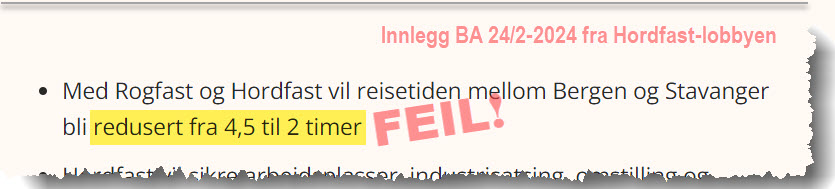
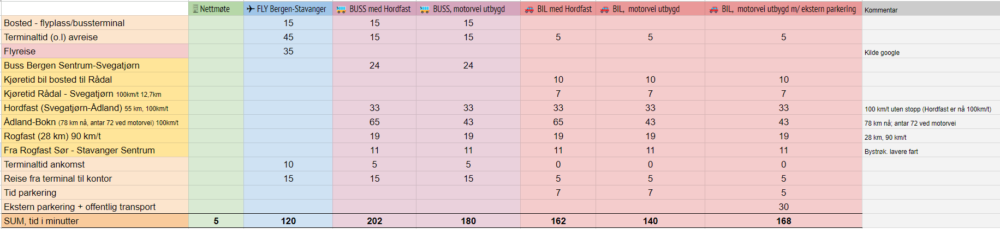
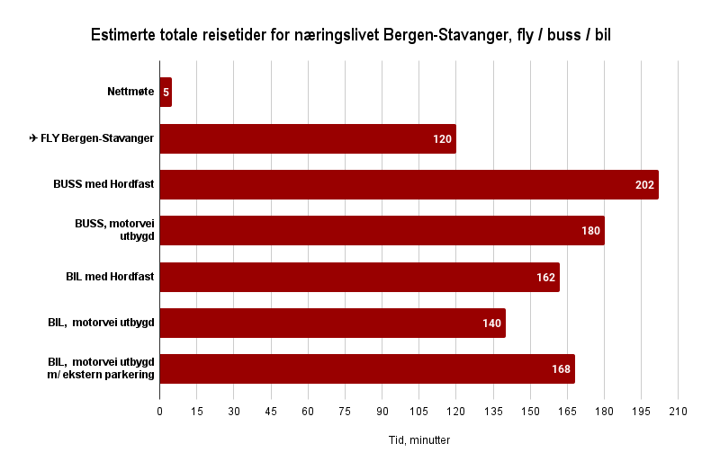

Det blir stadig hevdet av
[lobbyen](https://www.facebook.com/lkeskeland/posts/pfbid0abNTSyTMDsiqXt6YeQpZV4kMa2HjsVBCqC2Jr9LddDfgTBa3SJqsEvS74huRU9ial)
([inklusiv Vegvesenet](https://www.bt.no/politikk/i/MoJjR0/vegvesen-direktoer-roser-hordfast-det-er-vaar-tids-bergensbane))
at etter Hordfast, så blir flyruten Bergen-Stavanger lagt ned, og at det vil ta like
lang tid Bergen-Stavanger med ekspressbuss som med fly, nemlig to timer.

Dette må være feil. Ved å bruke realistiske estimat på total reisetid, inklusiv
terminaltider, så vil en reise ekspressbuss vil ta minst 3 timer og 20 minutter etter
Hordfast. Også en bilreise vil ta betydelig lengre tid enn flyreise (ca. 2 timer og 42
minutter for bil, mens ca 2 timer for fly).

Selv ved fullt utbygget motorvei Bergen-Stavanger (neppe realisert før tidligst 2038,
hvis noen gang), så er fly best på tid, også bedre enn bil.

Og flyruten blir neppe lagt ned, men vi ser ikke bort fra at tilbudet kan reduseres
betydelig, noe næringslivet vil tape på!

Figuren viser total reisetid for forskjellige reisemåter etter (eventuell) Hordfast.
Antar Rogfast er ferdigbygget. Bil fra "dørstokk til møterom" vil typisk bruke 42
minutter mer enn fly.



<!-- markdownlint-disable-next-line MD033 -->
<iframe src="https://jcrivenaes.github.io/bomfasttools/reisetid.html" width="100%" height="420" style="border:0;" loading="lazy" title="Reisetid Bergen-Stavanger"></iframe>


## Hvor lang tid tar fly Bergen-Stavanger?

I følge reisetabeller tar selve flyturen Bergen - Stavanger ca. 20 minutter. Inkluderer
man tid på rullebanen, er selve reisen på ca. 35 minutter. Inkluderer man så i tillegg
reisetid til/fra flyplass samt ventetid på flyplass (som er betydelig før avgang), så er
den totale reisetiden om lag 2 timer. Fra dørstokk hjemme til møterom på Forus. Dette
har jeg erfaring på selv.

Hadde man klart å redusere terminaltiden før avreise fra 45 minutter til for eksempel 20
minutter, så kunne total reisetid kommet ned til 1 time og 35 minutter.

## Hvor langt kommer en buss på 35 minutter?

Først, husk at maks tillatt hastighet for busser i Norge er 100 km/t. Dersom en buss
starter på Bergen busstasjon og Hordfast er realisert, vil den etter 35 minutter reise
ha kommet Reksteren. Med andre ord, den er så vidt ute av Bjørnafjorden kommune. Da er
flyet allerede landet i Stavanger. Bare selve bussturen sentrum Bergen til sentrum
Stavanger vil ta 2 timer og 32 minutter, dersom ingen stopp. Men du skal jo komme deg
til og fra bussen også, skal du ikke?

## Gjelder til/fra terminal og terminaltid kun for fly?

Tydeligvis, for noen. Men er man ærlig så må man innrømme at bussen neppe står klar i
hagen din dersom du skal reise. En må komme seg til bussterminalen først, og en bør møte
opp om lag 15 minutter før avgang (så har man litt å gå på).

## Eksempel total tid fly versus totaltid buss

Tabellen nedenfor viser et tilfelle der den reisende bor like langt fra flyplassen som
fra bussterminal, og hvor destinasjon også er like langt fra bussterminal som fra
flyplass. Et typisk eksempel vil være fra Nesttun i Bergen til industriområdet Forus i
Stavanger. Siden det er ekspressbuss uten stopp, så kan man ikke regne med å kunne
"hoppe på bussen" på Nesttun (med mange stopp underveis øker naturligvis reisetiden for
bussen betydelig). Nei, vi må reise til bussterminalen sentralt i Bergen først.

Husk at når [svindyre Rogfast](../rogfast/) er ferdig
([ca. 2033](https://www.veier24.no/artikler/den-andre-av-tre-store-rogfast-kontrakter-er-na-utlyst/517760))
og hvis Hordfast blir realisert, så er det likevel et langt stykke (78 km) der
gjennomsnittsfarten i dag (i følge Google maps) er rundt 70-75 km/t. Dette strekket kan
omtales som "Stord-Bokn", og
[blir tidligst realisert i 2038](https://www.vegvesen.no/vegprosjekter/europaveg/e39boknstord/nyhetsarkiv/vegvesenet-foreslar-at-kommunene-er-planmyndighet-for-e39-bokn-hope/),
hvis noen gang. Merk for øvrig at planer om å erstatte Bømlafjordtunnelen og strekningen
rundt ikke er med i SVV sine planer så langt, så reisetidene oppgitt her er faktisk for
optimistiske for bil og buss.

Ekspressbuss uten stopp er trolig urealistisk også. Trolig vil bussen stoppe 2 steder,
for eksempel Leirvik og Aksdal, for å plukke opp passasjerer der og kanskje lade. Da
blir total reisetid om lag 4 timer.

## Hva med bil?

Gjør man samme regnestykke med bil, så finner man at selv etter Hordfast, vil total
reisetid være ca. 2,5 timer. Selv etter eventuell motorvei hele strekket, så vil
kjøretiden være over 2 timer, da man inn mot by-sentrene ikke har 100 km/t. For å
begrense biltrafikken inni byene så vil det trolig legges opp til større
parkeringsanlegg ved innfarten, og at man deretter må ta kollektiv eller drosje til
destinasjon. Da vil også den totale reisetiden øke, gjerne med 30-40 minutter. For
eksempel tar bybanen i Bergen, fra Rådal til sentrum, over 30 minutter!

Figuren her viser detaljert tidsplan for de forskjellige reiseformene

## Hva vil en bilreise koste?

En flyreise til Stavanger koster i dag fra 500 kroner (lavpris) til 2000 kroner. En
bilreise, i bompenger etter Hordfast er bygget, og inklusiv parkeringsavgift, kan typisk
ligge på 1300-1500 kroner (Rogfast 400 kroner, Hordfast 500 kroner, Rådal-Svegatjørn 55
kroner, bomring i byen 50 kroner, parkering typisk 200 kroner, samt drivstoff og
slitasje av bilen). Så billigere er det neppe.

## Hva er konsekvensene hvis flytilbudet legges ned, eller reduseres kraftig?

Først, at flyruten legges helt ned mellom Bergen og Stavanger er usannsynlig, da disse
er en del av en kystruten fra Trondheim til Kristiansand. Men tilbudet kan bli kraftig
redusert, slik at næringslivet får færre alternativer. Vil virkelig næringslivet i
Bergen og Stavanger ønske seg lengre reisetid?

## Er elektriske sjøfly fremtiden, i stedet for motorvei?

Mye kan skje innen samferdsel de kommende årene. I samferdsel regnes nytte nå hele 75 år
frem i tid, men dette antyder at vi kjører bil på samme måte som nå helt til år 2100.
Hvor sannsynlig er det? For tiden pågår mye forskning på fremtidens transport, og
elektriske sjøfly kan være realitet om bare 10 år. For Vestlandets krevende topografi
med fjorder og fjell vil det være en svært fleksibel måte å reise på, og også svært
rask. Nettstedet
[Elflyportalen](https://www.elflyportalen.no/annenmedia/elektriske-sjofly-i-rutetrafikk-innen-2030/index.html)
reklamerer med reisetider på 1 time fra Bergen sentrum til Stavanger sentrum (la oss is
1,5 time; likevel adskillig raskere enn buss). Et annet alternativ er
[Volocopter](https://www.volocopter.com/). Noe å tenke på.

## Den aller raskeste måten å møtes på?

Er selvfølgelig nettmøter! Selv hadde jeg en del reising mellom Bergen-Stavanger en
periode, men etter muligheten med nettmøter kom, er disse reisene betydelig sjeldnere.
Sparer da både egen tid, og sparer miljøet. En vinn-vinn!

## Konklusjon

Hvis næringslivet virkelig vil ha lengre reisetid Bergen-Stavanger og dårligere
flytilbud, samt være en aktiv pådriver for å
[bygge ned unikt naturmangfold](https://www.vestlandfylke.no/globalassets/fylkesveg/presentasjonar/naturvernforbundet-pa-stord.pdf)
og
[øke klimagassutslipp betydelig](https://www.bt.no/nyheter/lokalt/i/69kEne/vegvesenet-hevdet-at-hordfast-er-best-for-klimaet-naa-har-naturvernforbundet-tatt-frem-kalkulatoren),
så bør de promotere Hordfast.

## Feil i regnestykket?

Mener du regnestykket er feil på noe vis eller har andre konstruktive kommentarer,
[så ta kontakt med oss](/kontakt).
