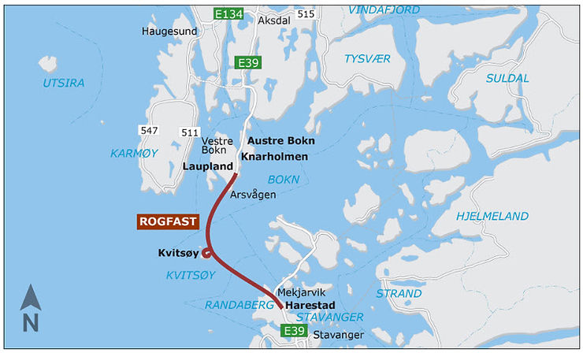
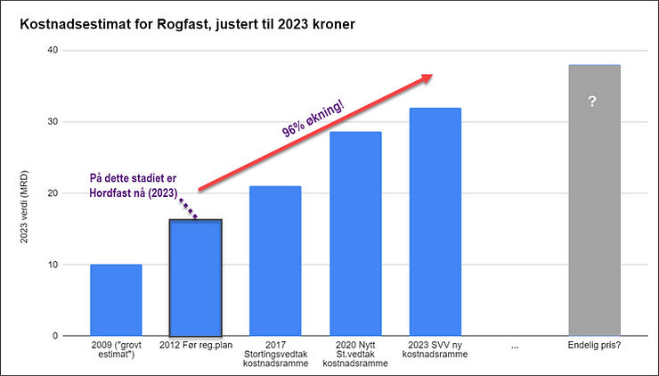
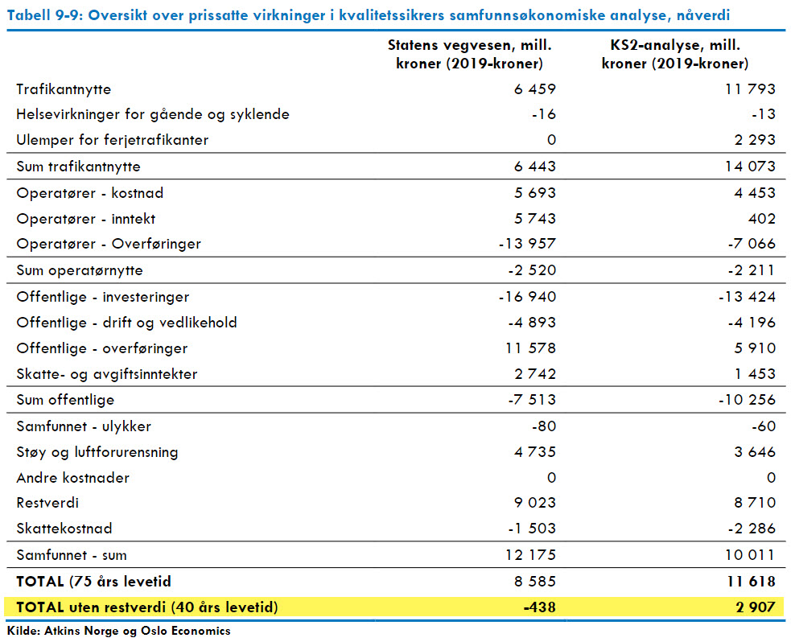

Rogfast blir verdens lengste undersjøiske tunnel, og bygging har startet. I 2009 skulle
prosjektet koste 6 milliarder kroner (tilsvarer 10 milliarder 2023 kroner, inklusiv
prisstigning og endring i momsregler). Før reguleringsplanen i 2012 var kostnaden steget
til 10,2 milliarder (16 milliarder 2023 kroner). Men nå er kostnadsrammen nesten 32
milliarder, og ennå gjenstår 10 år med krevende bygging (til 2033), så prisen kan øke
ytterligere. Skulle Hordfast sprekke tilsvarende, blir prisen der om lag 92 milliarder.
Minst.

I sør har vi [Rogfast](https://no.wikipedia.org/wiki/Rogfast), "lillesøsteren" til
Hordfast, som også et ["grensesprengende" prosjekt](http://www.bygg.no/article/1415350).
Idéen her er en nesten 27 km lang undersjøisk tunnel mellom Randaberg og Bokn via
Kvitsøy. Hvor attraktivt det blir å pendle frem og tilbake i en slik lang, mørk og dyp
tunnel gjenstår å se. Man skal i hvert fall ikke ha
[redsel for jordskjelv](https://www.nrk.no/rogaland/rogfast-ligg-i-jordskjelvutsett-omrade-_-vegvesenet-har-ikkje-vurdert-det-som-ein-risiko-1.15691653)
eller
[klaustrofobi](https://www.aftenbladet.no/lokalt/i/n82Wn/koeyrer-lange-omvegar-for-aa-unngaa-tunnelar).

Rogfast blir regulert for 90 eller 100 km/t, og i tillegg til 4 felts tunnel mellom
Harestad og Bokn, er det en
[komplisert avstikker mot Kvitsøy](https://no.wikipedia.org/wiki/Kvits%C3%B8ytunnelen).
På Kvitsøy bor det "hele" [523 personer](https://snl.no/Kvits%C3%B8y), så det blir en
[svært dyr avstikker](https://www.aftenposten.no/meninger/debatt/i/kJL2dQ/er-jon-georg-dale-samferdselsminister-kun-for-vestlandet-jon-ivar-nygaard).

## Kostnadene som sprakk, gang på gang

I 2009 skulle Rogfast
[koste 6 milliarder](https://www.bygg.no/rogfast-koster-10-2-milliarder/96953!/) som
"grovt estimat", mens 3 år senere
[i 2012 så mente SVV at prisen ville være 10,2 milliarder](https://www.nrk.no/rogaland/rogfast-koster-minst-10-milliarder-1.8398659).

[I 2015 var prisen steget til 13,8 milliarder](https://paperpile.com/app/p/ebd46601-c3d4-06c0-a3c7-210fca08be13)
(2014 kr) med en (påstått) usikkerhet på pluss/minus 10%(!). Men det fortsatte bare å
stige...

Etter reguleringsplanen ble det utført en
[ekstern kvalitetssikring (KS2)](https://www.regjeringen.no/contentassets/fdc580b4c1e24dcf9fb4d44d6018d61f/kvalitetssikring-ks2-e39-rogfast.pdf)
som var tydelig kritisk til tallene fra SVV (som da sa 14,8 milliarder som mest
sannsynlig (P50) estimat). Noen utdrag fra
[oppsummeringen](https://osloeconomics.no/e39-rogfast-er-samfunnsokonomisk-lonnsom-men-krever-hoye-bomsatser/):

- Finansieringen av prosjektet krever uvanlig høye bomsatser. Det er lav sannsynlighet
  for å få finansiert prosjektet i løpet av en 20 års bompengeperiode, selv om
  prosjektet med en bomtakst på 330 kroner er samfunnsøkonomisk lønnsomt.
- Vi er skeptiske til at kvalitetsmålet er satt som lavest prioritert, da vi oppfatter
  at det er begrensede muligheter for å redusere noe her. Fremdriftsplanen for
  prosjektet er lite detaljert sammenlignet med hva man må forvente i et forprosjekt.
  Styring av prosjektet bør skje gjennom en egen styringsgruppe, og prosjektledelsen
  anses underbemannet innen enkelte områder.

[Stortinget vedtok likevel i 2017 å bygge Rogfast](https://www.regjeringen.no/contentassets/cd655bc03025422798fef5cb45586951/nn-no/pdfs/prp201620170105000dddpdfs.pdf)
med en utbyggingskostnad (styringsramme) på 16,8 milliarder (P50, median) med en øvre
ramme 18,4 milliarder (P85) 2016 kroner. P85 betyr at det er antatt 85% sannsynlig at
prisen ikke overstiger dette tallet, og kalles også kostnadsramme.

## Prosjektet ble vurdert stoppet i 2020

"Hele" 2,5 år senere ble prosjektet
[satt på vent på](https://www.aftenbladet.no/lokalt/i/JoXwdX/rogfast-utsatt-pa-ubestemt-tid)
på grunn av kjempesprekk før byggingen var satt i gang, og
[prosjektlederen er byttet ut](https://www.aftenbladet.no/lokalt/i/pLeOkE/gunnar-eiterjord-i-intern-e-post-rogfast-far-ny-prosjektleder).
Kilder anga et nytt prisoverslag på 25 milliarder, selv om SVV hardnakket hevdet at de
skulle kunne klare å få det ned til 21 milliarder. Etter en ny runde med beregninger ble
det i Stortinget fremsatt en
[ny proposisjon høsten høsten 2020](https://www.regjeringen.no/contentassets/8e5b283f2fd34f7b8559705ad9d2502b/nn-no/pdfs/prp202020210054000dddpdfs.pdf)
der styringsrammen satt til 20,6 milliarder mens kostnadsrammen (øvre ramme) ble økt til
hele 24,8 milliarder. Staten sin andel øker fra 3,6 milliarder til 8,24 milliarder, og
de estimerte gjennomsnittsbompengene er nå hele 409 kroner (år 2020 kroner)! Det ble
også besluttet at staten skal ta ytterligere kostnadsøkninger alene, siden bompengelånet
allerede er på smertegrensen av hva bilistene kan tåle, og hva fylkeskommunen kan
garantere for.

## Nye kostnadssprekker

Men dette fortsetter å stige. Siste tallet fra
[Statens Vegvesen](https://www.vegvesen.no/globalassets/om-oss/om-organisasjonen/arsrapporter/tertialrapport-for-statens-vegvesen-per-30.-april-2023_.pdf?v=4a25e1)
er nå om lag 32 milliarder (2023 kroner) i kostnadsramme. Hvor ender dette?

I figuren nedenfor oppsummeres endringene i kostnader. Merk at grafen tar hensyn til en
momsendring i 2013 og alle tall er justert for generell prisstigning til 2023 nivå
(konsumprisindeks), slik at kolonnene er er direkte sammenlignbare. Etter
stortingsvedtaket er kostnadsramme (øvre ramme) brukt i grafen, dette fordi alle store
prosjekter som er ferdigstilt de siste 15 årene har oversteget kostnadsrammen
(Hardangerbrua, Hålogolandsbrua, Rådal-Svegatjørn, Ryfast, osv.)

## Mot 40 milliarder?

Studerer man reell kostnad for andre store prosjekter så ser man tydelig at
[kostnaden øker betydelig under bygging](https://www.ba.no/de-store-veiprosjektene-sprenger-prisantydningene/s/5-8-1868088).
Likevel kan man ikke stoppe prosjektene, da man er kommet til "point of no return". Man
støter stadig vekk på "uforutsette" problemer som dårlig fjell, problemer med
forurensede masser, etc. E39 Svegatjørn-Rådal, Hålogolandsbrua og Ryfast er alle
eksempler på dette. Førstnevnte (Svegetjørn-Rådal) skulle koste 6,5 milliarder i 2014
(ca. 8,3 milliarder 2023 kroner), men siste rapport fra SVV viser at
[sluttkostnaden nå er rundt 12 milliarder](https://www.vegvesen.no/globalassets/om-oss/om-organisasjonen/arsrapporter/tertialrapport-for-statens-vegvesen-per-30.-april-2023_.pdf?v=4a25e1).
Så at Rogfast kan ende på 40 milliarder til slutt er ikke utenkelig, dessverre.

## Samfunnsnytten som forsvant

For beregning av prissatt samfunnsnytte har det lenge vært konsensus i fagmiljøet på at
levetid som brukes skal være 40 år. Dette
[har også lenge vært instruks fra myndighetene](https://www.regjeringen.no/globalassets/upload/fin/vedlegg/okstyring/rundskriv/faste/r_109_2021.pdf).
Man kan argumentere at broer/veier kan vare lengre enn 40 år, men problemet er at vi
ikke vet hvilken teknologi vi har om 40 år. Det kan jo være at mange da vil reise mellom
øyene på Vestlandet med [volokopter](https://www.volocopter.com/) eller
[elektriske sjøfly](https://www.nrk.no/vestland/elektriske-fly-mellom-bergen-og-forde-1.16427436)
eller at Elon Musk sin
[hyperloop](https://samferdsel.toi.no/meninger/hyperloop-lynrask-reise-for-mennesker-og-varer-article34856-677.html)
er realisert mellom Bergen og Stavanger? Kanskje egen bil er helt avleggs? Et annet
argument for 40 år er at sammenligningen skal også gjelde det såkalte null-alternativet,
altså fortsette dagens løsning.

Rogfast har lenge vært markedsført som
[et av de mest lønnsomme prosjektene i NTP](https://www.aftenbladet.no/lokalt/i/9qjEd/rogfast-landets-mest-loennsomme-veiprosjekt).
Men i
[materialet fra KS2](https://archive.org/download/bomfast-kildedokumenter/atkins_2020--sluttrapport_ks2_rogfast_uten_vedlegg_oktober2020)
finner vi at SVV nå innrømmer at samfunnsnytte ved 40 år nå er null, mens KS2 (Atkins)
sin analyse viser et svakt positiv tall. Men dette gjelder kun hvis kostnadene følger
styringsmålet (20,6 mrd kroner fra Stortinget)! Basert på nåværende kunnskap er dette
helt usannsynlig. Så enkel matte sier at dersom hele kostnadsrammen blir brukt (24,8
milliarder 2020 kroner) så er netto nytte (40 år) for Rogfast negativ i størrelsesorden
3 til 5 milliarder kroner (merk at kostnadsrammen nå er ytterligere oppjustert).

Imidlertid har veimyndighetene nå funnet at man skal beregne 75 år levetid i stedet for
"store prosjekter", noe som
[tilsynelatende øker nytten](https://www.tu.no/artikler/store-veiprosjekter-ble-mer-lonnsomme-over-natta-okte-levetiden-fra-40-til-75-ar/511504)
betydelig. Det får også Rogfast glede av. Så mens den først KS2 rapporten ikke
diskuterte levetid med ett ord, så ender det plutselig opp med 75 år som "fasit" i den
andre KS2 rapporten. Her regner man fra 8 til 11 milliarder positiv nytte dersom Rogfast
kommer til å koste 20,6 milliarder (2020 kroner).

Dersom Rogfast koster 20,6 milliarder ja, men det vil ikke skje, se grafen over.
Allerede nå er SVV redd for at øvre ramme blir sprengt (satt til 26 milliarder i
Statsbudsjettet 2021/2022 og justert til 32 milliarder i 2023), se
[denne artikkelen i Haugesund avis](https://www.h-avis.no/ratafjell-og-prisstigning-kan-sprenge-rogfast/s/5-62-1324654).
Og at
[byggetiden blir lengre enn 10 år](https://www.aftenbladet.no/lokalt/i/66dKjL/rogfast-hvis-byggetiden-forlenges-med-et-par-aar-blir-det-fort-utro)
øker kostnaden ytterligere.

I beregningen til nytten av Rogfast, var forutsetningen at fergene går på fossilt
drivstoff. Fra Hordfast vet vi nå at dersom batteriferger brukes i stedet for fossilt
drivstopp,
[så senkes nytten betydelig](https://www.bt.no/innenriks/i/dlJdjX/gigantbroen-vil-gi-en-stor-klimagevinst-mener-tilhengerne-naa-er-et-nytt-regnestykke-klart).
For Hordfast sin del rundt 13 milliarder, noe som gjør at vi kan grovt anta at nytten
ved Rogfast går ned 7-10 milliarder ved å anta ikke-fossile ferger. Så i sum er det nå
rimelig å anta at den egentlige samfunnsnytten ved Rogfast er betydelig på minussiden.

## Er trafikkprognosene realistiske?

Både SVV og KS2 mener at trafikken ved oppstart vil være rundt 6000 ÅDT. Ser man på
trafikken de siste 5 årene Mortavika-Årsvågen, så har den vært flat mellom 2013 og 2019
på om lag 4100 i ÅDT, men et lite hopp i 2022 pga. halverte fergepriser, som kanskje
flater ut i 2023. Men hvorfor i all verden skal det komme om lag 2000 nye kjøretøy ved
åpning i 2033 med bompenger for lettbil på over 370 (2020) kroner?

## Hva med vedlikeholdskostnader for Rogfast?

KS2 rapporten indikerer en diskontert vedlikeholdskostnad på mellom 4 og 5 milliarder
(2020) kroner for Rogfast. Fordelt over 75 år, men standard renter, tilsvarer det om lag
200 millioner kroner pr år for en veistrekning på om lag 27 kilometer. Eller om lag 1%
per år av den opprinnelig antatte byggekostnaden på 20 mrd. Tunneler er dyre å
vedlikeholde, men det er
[utvilsomt broer også](https://www.johndcook.com/blog/2010/03/31/maintenance-costs/). I
Hordfast er det planlagt totalt over 8 km med 4 felts broer, 16 km med tunnel, hvor av 8
km er undersjøisk. I tillegg kommer om lag 32 km veg i dagen (inklusiv mindre broer).

## Rogfast og ikke-prissatte verdier

Siden Rogfast for det meste går i tunnel er negative virkninger overfor naturmangfold,
dyrket mark, landskap og kulturminner relativt små, i hvert fall sammenlignet med
Hordfast. Det største problemet er de store mengdene med stein som skal deponeres, og
deler av Kvitsøy blir sterkt påvirket. Klimagassutslippet i forbindelse med byggingen er
nok betydelige, men de ble ikke omtalt i noen grad verken av Vegvesenet eller
kvalitetssikrer.

## Hva hvis Hordfast utvikler seg som Rogfast?

Hordfast er nå på stadiet "før reguleringsplan" (se figuren over). Som nevnt, da Rogfast
var på samme stadium i 2012 var prisen altså estimert til litt over 10 milliarder 2012
kroner, som er om lag 16 milliarder 2023 kroner. Tallene for Rogfast viser altså nå
fordoblet kostnad, selv om vi tar hensyn til prisstigning. Dobbel pris av Hordfast (46
milliarder per 2023) blir 92 milliarder!

Hordfast har per i dag lav prissatt nytte, om lag 1 milliard kroner,
[se NTP (2022-2033)](https://www.regjeringen.no/contentassets/fab417af0b8e4b5694591450f7dc6969/no/pdfs/stm202020210020000dddpdfs.pdf)
(dersom 38,5 milliarder 2021 kroner, som er svært usannsynlig) og
[innspill til NTP 2025](https://www.nrk.no/vestland/nye-klimaberekningar_-hordfast-som-vil-gi-ferjefri-e39-over-bjornafjorden-har-negativ-samfunnsnytte-1.16408254).
Og det selv med 75 års nytteberegning! Den
[ikke-prissatte nytten er stor negativ](https://www.bygg.no/statsforvalteren-i-vestland-bekymret-for-naturinngrep-pa-e-39/1487997!/),
det er udiskutabelt.

Så hvis Hordfast gjennomføres med samme kostnadsutvikling som Rogfast, så får vi et
["grensesprengende" prosjekt](https://www.samferdselinfra.no/veier-og-fjordkrysninger-endrer-og-moderniserer-verden/)
som "pengemessig" koster samfunnet (veldig mye) mer enn det vi får igjen, og som i
tillegg har en uerstattelig kostnad for naturmangfold, landskap og kulturminner.

## Se også

- [Tankevekkende tall her](https://www.aftenbladet.no/meninger/debatt/i/b5wQ8B/rogfast-er-basert-paa-juksetall)
  om reisetid og samfunnsnytten i en kronikk fra Torfinn Ingeborgrud
- Debattinnlegg
  [av Roald Kvamme](https://www.aftenbladet.no/meninger/debatt/i/Xg7Pxm/draumen-om-ferjefri-e39-er-blitt-eit-konomisk-mareritt)
- Svein Haugberg:
  [Feil at Rogfast vil gi et stort felles bo- og arbeidsmarked](https://www.aftenbladet.no/meninger/debatt/i/Vb092V/feil-at-rogfast-vil-gi-et-stort-felles-bo-og-arbeidsmarked)
