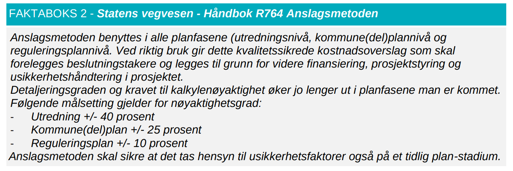

Større norske veiprosjekter sprekker ikke bare litt – de sprekker systematisk!

Det mest markante er at tidligfase/KVU-anslagene er altfor lave. Man kan sikkert skylde
på at forutsetninger og krav endrer seg underveis, men avvikene er så store at dette
fremstår som en utilstrekkelig forklaring (litt av vitsen med kostnadsestimater i tidlig
fase må jo være å ta høyde for ukjente faktorer i fremtiden!).

Men også etter vedtak i Stortinget så sprekker de fleste store prosjekter betydelig,
relativt til styringsrammen. I praksis betyr det at prosjekter som kanskje er marginalt
samfunnsøkonomisk lønnsomme når de vedtas, blir klart ulønnsomme for samfunnet når alle
regningene er betalt.

Analysen her er løst inspirert av en avisartikkel:
["De store veiprosjektene sprenger prisantydningene"](https://www.ba.no/de-store-veiprosjektene-sprenger-prisantydningene/s/5-8-1868088)
i Bergensavisen fra 2022. Dessverre er denne bak betalingsmur.

## Begreper brukt og prinsipper for utregning

### KVU, KS1 og KMD

En KVU er en [konseptvalgutredning](https://no.wikipedia.org/wiki/Konseptvalgutredning).
Dette er en tidligfase utredning, der forskjellige konsepter skal sammenlignes, og både
prissatte kostnader og ikke-prissatte konsekvenser skal veies inn. Etter KVU kommer en
ekstern kvalitetssikring som kalles KS1, dersom kostnadsrammen er på over 1 milliard
kroner. KVU med KS1 ble formelt innført i 2005, så noen av prosjektene her har ikke en
"korrekt" KVU med KS1, men tilsvarende tidligfase evaluering eller "første omtale" som
blir her omtalt som KVU likevel. Neste steg er KMD,
[kommunedelplan med konsekvensutredning](https://www.vegvesen.no/fag/veg-og-gate/planlegging-prosjektering-og-grunnerverv/planlegging/kommunedelplan-med-konsekvensutredning/),
der man detaljerer ytterligere, ser på konsekvenser, og velger en anbefalt løsning. Det
er dessverre ingen ekstern kvalitetssikring etter KMD.

### Reguleringsplan med KS2

Om prosjektet går videre så
[lages en reguleringsplan](https://www.vegvesen.no/fag/veg-og-gate/planlegging-prosjektering-og-grunnerverv/planlegging/reguleringsplan/),
som er en detaljert planlegging. Kostnaden som beregnes i reguleringsplan er
utgangspunkt for hva Stortinget må bevilge. Siden dette er store beløp, gjøres det en ny
ekstern kvalitetssikring som kalles KS2.

### Styringsramme og kostnadsramme

Det er ingen automatikk at prosjekter med ferdig reguleringsplan og KS2 går videre til
bygging. For eksempel kan KS2 rapporten indikere en nødvendig tvil om samfunnet bør
realisere dette prosjektet (ikke samfunnsøkonomisk lønnsomt, for stor risiko, er imot
andre mål i samfunnet, etc). Prosjektet må først vedtas i Stortinget, som er bevilgende
myndighet. Basert på reguleringsplan, KS2 samt egne vedtak om bompenger (dersom
bompenger inngår), så vedtar Stortinget til slutt en styringsramme og en kostnadsramme.
Styringsrammen (median, P50) skal være hva prosjektet skal strekke seg etter (kalles og
"forventet kostnad"; selv om P50 og statistisk forventningsverdi teknisk sett ikke er
det samme), mens kostnadsrammen er øvre ramme som "kan tåles" (og kalt P85 percentil).

### Prinsipper for utregningene

- For å kunne sammenligne kostnader så må de indeksreguleres. Her er det gjort med
  generell prisstigning ved å bruke
  [konsumindekskalkulatoren til SSB](https://www.ssb.no/kalkulatorer/priskalkulator).
  Som eksempel vil 10 milliarder i 2004 tilsvare 16,49 milliarder kroner i 2024. De
  indeksregulerte prisene på 2024 nivå er angitt i klammer med en annen farge, som for
  eksempel [16,49 MRD].
- Man kan også argumentere for at sammenligningen bør følge
  [byggeprisindeks for veianlegg](https://www.ssb.no/priser-og-prisindekser/byggekostnadsindekser/statistikk/byggekostnadsindeks-for-veganlegg).
  I det store bildet skal den være lik KPI, men de siste årene har nok prisene i
  byggebransjen økt mer enn den generelle prisveksten. På den andre siden, så er jo
  kortsiktige konjunkturer frem i tid noe reguleringsplan og KS2 bør ha en prognose på,
  og legge det inn i usikkerheten og kostnadsestimatet. I statsbudsjettet konkurrerer
  veianlegg med andre poster som i gjennomsnitt følger den generelle prisveksten.
  Hovedsammenligning her er derfor tallene justert for generell prisvekst (KPI). I mange
  av plottene er det to kolonner, der den andre er basert på byggeprisindeks.
- I 2013 skjedde det en endring i momsreglene, der veiprosjekter nå skal angis med full
  moms. En årsak til dette er blant annet at mange prosjekter har bompenger, og
  bompenger er momspliktige. Prosjekter før 2013 hadde en form for delvis moms. For å
  korrigere for dette, så angir en rapport fra
  [Norconsult](https://www.nho.no/contentassets/cabe412197dd4304a9970bc2c51a6798/norconsult-rapport-nho.pdf)
  at en multiplikator på 116% er rimelig å bruke på prosjekter før 2013.
- Det er kombinasjonen av momsjustering og prisjustering (konsumprisindeks +
  byggeprisindeks) som brukes for å kunne si hvor mye den reelle kostnadsøkningen er.

### Husk at reell sluttpris ofte kommer mange år etter åpning!

Ofte tror man at sluttprisen som blir oppgitt ved åpning av anlegget er den som blir den
reelle sluttkostnaden, men slik er det ikke! Vi ser at det påløper kostnader flere år i
etterkant. Et eksempel på det er Hålogolandsbrua, som ble åpnet i 2018. I
[årsrapporten for 2018](https://www.vegvesen.no/globalassets/om-oss/om-organisasjonen/arsrapporter/19-0083-arsrapport-2018-til-nett.pdf?v=49901c)
oppgir SVV et anslag for sluttkostnad på 3,965 milliarder 2018 kroner (tilsvarer 4,887
MRD 2024 kroner). Men i påfølgende år økte dette beløpet, og i
[tertialrapporten fra august 2024](https://www.vegvesen.no/contentassets/1965cea0073b470eba99533aeb713576/tertialrapport-for-statens-vegvesen-per-31.-august-2024.pdf?v=4aab58)
er beløpet 5,617 MRD 2024 kroner. Altså en netto økning på hele 15% i årene etter
åpning! Tilsvarende kan man finne ved de fleste store prosjekter.

## Ferdigstilte veiprosjekter

### Hardangerbrua

Hardangerbrua ble åpnet i 2013 til en
[kostnad på 3,266 MRD 2018 kroner](https://www.ntnu.no/concept/rv-7-hardangerbrua) [4,03
MRD]. Opprinnelig var estimatet i 1998 (her omtalt som for "KVU", kalt "Hardangerbrua")
på ca 1,6 milliarder 2018 kroner [1,96 MRD]. Reell kostnad økte da med 75% fra KVU
estimatet, etter man justerer for prisstigning og endringer i momsregler. Prosjektet
sprakk også med ca 16% i forhold til styringsramme vedtatt i Stortinget.
[Se også: Menon - Evaluering av Hardangerbrua.](https://menon.no/prosjekter/evaluering-rv-13-hardangerbrua/)

Merk at
[en rapport fra Concept i 2014](https://www.ntnu.no/documents/1261860271/1262021752/Kostnadsutvikling+i+vegprosjekter.pdf/34cd4f09-c2ff-4b19-9aab-4fd032c1811a?version=1.0)
hevder (side 24) at Hardangerbrua kom svært nær styringsrammen, men
[Menonrapporten fra 2018](https://menon.no/prosjekter/evaluering-rv-13-hardangerbrua/)
sier at Hardangerbrua overskred kostnadsrammen dersom KPI (konsumprisindeks) er
kriteriet, sitat: "Hvis forbruk og rammer heller hadde vært justert med
konsumprisindeksen hadde prosjektet opplevd en kostnadsoverskridelse." Trolig tok ikke
Concept rapporten hensyn til at reell sluttkostnad ikke er kjent før mange år etter
ferdistillelse.



<iframe src="https://jcrivenaes.github.io/bomfasttools/kostnadsprekker/hardangerbrua.html" width="100%" height="430" style="border:none;"></iframe>


### Hålogalandsbrua

[Hålogalandsbrua](https://no.wikipedia.org/wiki/H%C3%A5logalandsbrua) nær Narvik ble
åpnet i 2018. Formell KVU er ikke mulig å finne,
[men en avisartikkel referer til 1,5 milliarder i 2004](https://www.fremover.no/leserinnlegg/halogalandsbrua-tenk-positivt/s/1-55-1262279)
[2,86 MRD]. I
[2008 (KMD?) var kostnaden anslått til 1,86 MRD](https://no.wikipedia.org/wiki/H%C3%A5logalandsbrua)
2008 kroner [3,28 MRD]. Men sluttprisen endte på 5,617 MRD 2024 kroner (per
tertialrapport aug 2024).



<iframe src="https://jcrivenaes.github.io/bomfasttools/kostnadsprekker/haalogalandsbrua.html" width="100%" height="430" style="border:none;"></iframe>


### E39 Rådal-Svegatjørn

[Rådal-Svegatjørn](https://no.wikipedia.org/wiki/Svegatj%C3%B8rn%E2%80%93R%C3%A5dal) er
en 4 felts motorvei mellom Rådal i Bergen i Svegatjørn i Bjørnafjorden kommune.
Prosjektet ble åpnet høsten 2022. Endelig sluttkostnad inklusiv etterarbeid indikerer
[en sum på hele 11,63 milliarder 2024 kroner](https://www.vegvesen.no/contentassets/1965cea0073b470eba99533aeb713576/tertialrapport-for-statens-vegvesen-per-31.-august-2024.pdf?v=4aab58)
[11,63 MRD].

_Kilde:
[Reguleringsplan 2005](https://archive.org/download/bomfast-kildedokumenter/svv_2005--reguleringsplan_e39raadal_svegatjorn_2005)._

Den første omtalen "KVU planen" fra rundt år 2000 var planlagt med to felt og er derfor
ikke sammenlignbar. Dette ble imidlertid endret
[i den første reguleringsplan fra 2005](https://archive.org/download/bomfast-kildedokumenter/svv_2005--reguleringsplan_e39raadal_svegatjorn_2005),
hvor prosjektet ligner veldig på det som er resultatet i dag, med mesteparten av vegen i
tunnel og fartsgrense 100km/t (se bildet). Tar vi med kostnadene med forlengelsen mot
Sørås, så ser man at prognosen dengang totalt var estimert til 2,8 MRD [5,27 MRD].

Prosjektet ble så utsatt, men dukket opp igjen i
[NTP 2010-2019](https://www.regjeringen.no/contentassets/76ebed1a5cb741e780ad1bdb21513ae5/no/pdfs/stm200820090016000dddpdfs.pdf)
med en sum på 3,8 milliarder 2009 kroner [6,56 MRD]. Deretter fulgte en
[ny reguleringsplan som etter KS2](https://kudos.dfo.no/documents/31677/files/28099.pdf)
indikerte 6,2 MRD 2012 kroner [8,8 MRD]. I 2014 ble prosjektet vedtatt i Stortinget.



<iframe src="https://jcrivenaes.github.io/bomfasttools/kostnadsprekker/raadal-svegatjorn.html" width="100%" height="430" style="border:none;"></iframe>


### Rv 13 Ryfast

[Ryfast](https://no.wikipedia.org/wiki/Ryfast) (ekskl. Eiganestunnelen) er en ca 14,3 km
undersjøisk forbindelse mellom Ryfylke og Nordjæren/Stavanger, som ble åpnet i 2019. I
tidligfase
["KVU" i 2001 (konsept 4C)](https://web.archive.org/web/20250618204132if_/https://www.vegvesen.no/globalassets/vegprosjekter/fullforte/ryfast/vedlegg/13-ku.pdf?v=4990e4)
var prosjektkostnaden 0,83 MRD 2000 kroner [1,71 MRD] for Ryfast strekket (tunnel
Solbakk, Hundvåg). I tall fra 2007 (trolig fra KMD fasen) steg kostnaden til 4,4
milliarder [8,1 MRD]. Men prisen steg fortsatt, og i
[stortingsvedtaket fra 2012](https://www.regjeringen.no/no/dokumenter/prop-109-s-20112012/id682020/?ch=2)
var styringsrammen 5,22 milliarder 2012 kroner [8,64 MRD].
[Sluttkostnaden](https://www.vegvesen.no/contentassets/1965cea0073b470eba99533aeb713576/tertialrapport-for-statens-vegvesen-per-31.-august-2024.pdf?v=4aab58)
per aug 2024 er 11,3 MRD 2024 kroner.



<iframe src="https://jcrivenaes.github.io/bomfasttools/kostnadsprekker/ryfast.html" width="100%" height="430" style="border:none;"></iframe>


### E39 Eiganestunnelen

Eiganestunnelen er en videreføring av Ryfast mot Stavanger, og ble åpnet i 2019. Totalt
5 km vei, hvorav 3,7 km i tunnel.
[I samme KVU som for Ryfast](https://web.archive.org/web/20250618204132if_/https://www.vegvesen.no/globalassets/vegprosjekter/fullforte/ryfast/vedlegg/13-ku.pdf?v=4990e4)
kan vi finne et estimat på 0,77 milliarder 2000 kroner [1,59 MRD]. I
[NTP 2010-2019](https://www.regjeringen.no/no/dokumenter/stmeld-nr-16-2008-2009-/id548837/?ch=1)
som trolig er KMD, finner vi 1,6 milliarder 2009 kroner [2,4 MRD]. Sluttprisen ender på
[5,3 MRD] 2024 kroner. Relativt til KU er sluttsummen en økning på hele 234%! Relativt
til første Stortingsvedtak (som dessverre ofte er et "point of no return") er økningen
på 50% (34% relativt til Stortingsvedtaket i 2014).

Totalt har søsterprosjektene Ryfast + Eiganestunnelen kostet 16,6 milliarder 2024
kroner.



<iframe src="https://jcrivenaes.github.io/bomfasttools/kostnadsprekker/eiganes.html" width="100%" height="430" style="border:none;"></iframe>


### E18 Bommestad-Sky

Bommestad-Sky er et motorveiprosjekt nær Larvik og ble åpnet i mai 2018. Det er ikke
lett å finne noe KVU for dette prosjektet, men en avisomtale fra 2007 refererer muligens
til noe som tilsvarer KVU og antyder en prislapp på 2 milliarder 2007 kroner [3,57 MRD].
[Info fra SVV i 2011](https://web.archive.org/web/20240526224523if_/https://www.vegvesen.no/globalassets/vegprosjekter/utbygging/e18larvik/vedlegg/e18bommestskyprosjektinformasjon2011.pdf)
angir 3,2 milliarder 2011 kroner [5,2 MRD]. I
[2012 sa stortingsvedtaket](https://www.regjeringen.no/contentassets/c5fbd77a303849109ed670d87b14331a/no/pdfs/prp201220130123000dddpdfs.pdf)
en styringsramme på 4,2 milliarder 2012 kroner [6,7 MRD].

Relativt til de første anslagene steg prisen med 83%, mens økningen relativt til
stortingsrammen var på 15%.



<iframe src="https://jcrivenaes.github.io/bomfasttools/kostnadsprekker/bommestad-sky.html" width="100%" height="430" style="border:none;"></iframe>


## Prosjekter under bygging

### E39 Rogfast

[Rogfast](https://no.wikipedia.org/wiki/Rogfast) nord for Stavanger er under bygging og
er ventet å åpne i 2033. Sluttprisen er således ukjent, men
[Rogfast har en lang historie på spektakulære kostnadsprekker](/innsikt/rogfast), og det
er trolig ikke slutt. I
[2007 (KVU, jf. KS1 rapport)](https://web.archive.org/web/20220126135801if_/https://www.vegvesen.no/globalassets/vegprosjekter/utbygging/e39rogfast/vedlegg/kvu/ks1-boknafjordkryssingen.pdf)
var prisen om lag 5,5 milliarder [10,1 MRD], men siden steg det. Ved kommunedelplan i
2011-2012 var kostnad 10,2 milliarder 2012 kroner [16,9 MRD], riktignok etter at
strengere krav til stigning og sikkerhet ble inkludert. Men det var ikke nok, og prisen
økte ytterligere etter reguleringsplan og KS2.

Basert på KS2,
[vedtok Stortinget i 2017](https://www.regjeringen.no/contentassets/cd655bc03025422798fef5cb45586951/nn-no/pdfs/prp201620170105000dddpdfs.pdf)
en styringsramme på 16,8 milliarder [21,4 MRD], men måtte gjøres på
[nytt vedtak i 2020](https://www.regjeringen.no/contentassets/8e5b283f2fd34f7b8559705ad9d2502b/nn-no/pdfs/prp202020210054000dddpdfs.pdf)
da ingen entreprenører meldte seg. Gjeldende kostnadsramme er nå på hele 33 MRD 2024
kroner.

Selv om sluttsum ikke er kjent, og vi optimistisk antar at sluttsum blir "bare" 33 MRD
2024 kroner, så er sprekken fra KVU estimat på mer enn 225%! Relativt til kostnaden i
kommunedelplanen er sprekken på minst 94%. Sprekk i forhold til første vedtatte
styringsramme i Stortinget (2017) blir da på minst 55%.



<iframe src="https://jcrivenaes.github.io/bomfasttools/kostnadsprekker/rogfast.html" width="100%" height="430" style="border:none;"></iframe>


### Rv. 555 Sotrasambandet

[Sotrasambandet](https://www.vegvesen.no/vegprosjekter/riksveg/sotrabergen/) sin bygging
pågår, og opprinnelig planlagt åpnet i 2027 (blir trolig forsinket). I 2009, etter
[KS1 av KVU](https://web.archive.org/web/20240912155034if_/https://www.vegvesen.no/globalassets/vegprosjekter/utbygging/sotrabergen/vedlegg/ks1-sotra3.pdf),
skulle Sotrasambandet koste 4,5 milliarder 2009 kroner [7,77 MRD]. Siden ble prosjektet
omgjort til et [OPS prosjekt](https://www.vegvesen.no/vegprosjekter/ops-ppp/), der 15
til 25 år drift og vedlikehold etter åpning er lagt til i sluttprisen.

Prosjektet ble vedtatt i Stortinget i 2017,
[der proposisjonen sier](https://www.regjeringen.no/contentassets/70f2cd375bbf45ce8ddbb285a3212383/nn-no/pdfs/prp201720180041000dddpdfs.pdf):
"Rekna om til 2018-prisnivå er utbyggingskostnadene om lag 10,0 MRD. kr."

Men
[å få til en OPS kontrakt var ikke lett](https://www.bt.no/nyheter/lokalt/i/wP5XXo/byggenaeringen-advarer-mot-hoey-risiko-i-sotrasambandet),
og til slutt måtte man innse at dette sprakk så det sang. I 2022 inngikk man da en
totalkontrakt med det
[utenlandske selskapet "Sotra link"](https://www.vegvesen.no/vegprosjekter/riksveg/sotrabergen/nyhetsarkiv/sotra-link-er-vinner-av-ops-kontrakten-pa-sotrasambandet/)
på totalsummen på 23,1 MRD 2022 kroner. I
[Statsbudsjettet fra 2024](https://www.regjeringen.no/contentassets/d3a09b25308a48d792a1a366f3dffb22/no/pdfs/prp202420250001_sddddpdfs.pdf)
er kostnadsrammen 29 milliarder – dette inkluderer annet finansiering, risiko, samt
drift og vedlikehold over 15-25 år. For å gjøre prosjektet sammenlignbart med
tradisjonelle utbygginger kan byggekostnaden anslås til rundt 60–65 % av totalrammen. Et
konkret anslag (basert på informasjon i
[statsbudsjettet 2021](https://www.regjeringen.no/contentassets/23673b55781a4b29839d903e1e24411b/no/pdfs/prp202120220001_sddddpdfs.pdf))
tilsier om lag 62 %, som gir en byggekostnad på rundt 18 milliarder 2024 kroner [18
MRD]. Selv med et konservativt anslag innebærer dette en kostnadsøkning på over 130 %
fra det kvalitetssikrede KS1-estimatet.

Men det ender nok ikke her.
[I mars 2026 rapporterte NRK om nye sprekker](https://www.nrk.no/vestland/stor-kostnadssmell-pa-gigantprosjektet_-_-blir-5-milliardar-dyrare-1.17810746),
anslagsvis 5 milliarder kroner, som vi antar må gjelde en økning i selve byggekostnaden.
Legges dette på kostnadsrammen fra statsbudsjettet i 2024 (29 milliarder totalt,
estimert til 18 MRD for selve byggingen) så er vi oppe i 23 milliarder for selve
byggingen (34 milliarder totalt).

Hva endelig sluttpris kan bli er vanskelig å si. OPS prosjekter har begrenset innsyn, og
hvilke avtale utbygger har dersom "uforutsette omstendigheter" er uvisst. Enda verre
blir det om OPS selskapet går konkurs.



<iframe src="https://jcrivenaes.github.io/bomfasttools/kostnadsprekker/sotrasambandet.html" width="100%" height="430" style="border:none;"></iframe>


## Prosjekter under planlegging

### E39 Smiene-Harestad

[Smiene-Harestad](https://www.vegvesen.no/vegprosjekter/europaveg/e39smieneharestad/) er
strekningen mellom Eiganestunnelen i sør og der Rogfast starter. Strekket er om lag 4
km, og uten større broer og tunneler. I 2025 er kostnaden estimert til 5,4 milliarder
2025 kroner! Altså mer enn 1 milliard per kilometer (omtrent som Hordfast sin
reguleringsplan - bare det at Hordfast er teknisk mye mer komplisert).

Det startet mye lavere. I
[NTP 2006-2015 ble prosjektkostnaden oppgitt til 0,16 milliarder](https://www.regjeringen.no/contentassets/505d2819b6a54f7ca2bd309c0e610c99/no/pdfs/stm200320040024000dddpdfs.pdf)
2004 kroner [0,3 MRD], mulig dette er basert på en KVU. I kommunedelplanen i 2009 var
kostnaden 0,852 milliarder 2009 kroner [1,43 MRD]. Så ble prosjektet igjen nevnt i NTP
2018, denne gangen var prisen steget til 3,3 milliarder 2017 kroner [4,1 MRD].
[I reguleringsplanen fra 2024](https://web.archive.org/web/20240831212226if_/https://www.vegvesen.no/contentassets/1e6e40ce0a0146d39d2023c7fdc52c4c/1_planbeskrivelse.pdf)
er siste overslag på [4,348 MRD]. KS2 rapport finnes i skrivende stund ikke, og vedtak i
Stortinget gjenstår.

[En ytterligere sprekk ble meldt høsten 2025](https://www.nrk.no/rogaland/e39-smiene-harestad-kan-bli-flere-millioner-kroner-dyrare-1.17631050),
der prislappen ble justert på 5,4 milliarder (2025) kroner [5,24 MRD 2024 kroner].

Selv om ikke spaden er satt i jorden, så har få prosjekter sett en slik spektakulær
sprekk! Fra KVU til dagens kostnadsramme er sprekken på over 1600%! Så langt...



<iframe src="https://jcrivenaes.github.io/bomfasttools/kostnadsprekker/smiene-harestad.html" width="100%" height="430" style="border:none;"></iframe>


## Oppsummering

Alle disse prosjektene viser en voldsom sprekk fra KVU til sluttpris (eller estimert
sluttpris). Det heter at KVU estimatet skal være et anslag med pluss/minus 40%
usikkerhet. Avvikene er ensidig i én retning, noe som tyder på systematiske
underestimater, da samtlige av disse prosjektene i dette utvalget sprekker med langt mer
enn 40%. Merk også at "anslagsmetoden skal sikre at det tas hensyn til
usikkerhetsfaktorer også på et tidlig plan-stadium".

_Kilde:
[Norconsult-rapport for NHO](https://www.nho.no/contentassets/cabe412197dd4304a9970bc2c51a6798/norconsult-rapport-nho.pdf)._

Tabellen nedenfor oppsummerer funnene. Den viser at relativt til KVU (eller første
omtale) er sprekkene fra 75% til hele 1669%.



<iframe src="https://jcrivenaes.github.io/bomfasttools/kostnadsprekker/sumtable.html" width="100%" height=520 style="border:none;"></iframe>


Enda mer alvorlig er det at også relativt til Stortingsvedtaket sin forventede kostnad
(styringsramme), så ser vi en systematisk økning i sluttpris. Når prosjektet blir
vedtatt i Stortinget blir sprekken i disse eksemplene fra 15% til over 80%. Altså en
snitt verdi på 40% i tabellen over!

## Diskusjon

Flere tidligere rapporter har funnet den voldsomme prisveksten fra KVU til ferdig
anlegg, blant annet
[en rapport fra Norconsult bestilt av NHO (2016)](https://www.nho.no/contentassets/cabe412197dd4304a9970bc2c51a6798/norconsult-rapport-nho.pdf).
Imidlertid hevder denne rapporten at "Et klart funn fra vår gjennomgang er at når
innholdet i vegprosjektene er blitt konkretisert og vedtak er fattet, blir som
hovedregel byggekostnadene i samme størrelsesorden som forventet. Slik sett har vi i
liten grad hatt reelle kostnadssprekker i norske vegprosjekter de senere årene."

Javel? Dette er i strid med eksemplene som er gjort her, som viser betydelig
kostnadssprekk fra Stortingsvedtak til sluttpris, men kan selvfølgelig også skyldes
utvalget av prosjekter. Som eksempler bruker Norconsult rapporten både Rådal-Svegatjørn
og Rogfast, men de får ikke med seg de store kostnadsprekkene som har skjedd i disse
prosjektene siden 2016, etter at styringsramme ble vedtatt i Stortinget.

Andre rapporter som omhandler samme tema:

- [Kostnadsutvikling i vegprosjekter underlagt KS2 (2014)](https://www.ntnu.no/documents/1261860271/1262021752/Kostnadsutvikling+i+vegprosjekter.pdf/34cd4f09-c2ff-4b19-9aab-4fd032c1811a?version=1.0)
  av M. Welde. Her hevdes at kostnadskontrollen i gjennomføringsfasen stort sett er god,
  mens et stort flertall av prosjektene har altfor lave estimat i tidlig fase.
- [Hvor godt lykkes norske vegprosjekter?](https://www.ntnu.no/documents/1261860271/1262021752/Meta+evaluering+vegprosjekter.pdf/9aaadd5a-6380-9de5-baec-91e5714db05f?t=1733391911728)
  (Concept arbeidsrapport 2024-4). Her omtales en del veiprosjekter i etterkant. Side
  25: "De evaluerte prosjektene har en stor andel kostnadsoverskridelser. Henholdsvis 67
  % og 33 % har hatt en sluttkostnad over styrings- og kostnadsrammen, og
  gjennomsnittlig avvik fra styringsrammen er hele 7 %."

## Hva hvis?

Til slutt noen retoriske spørsmål:

- KVU / tidligfase estimatene er systematisk alt for lave. Blir dette gjort for å få
  prosjektet inn i NTP og derved "sette i gang snøballen" og så "komme til
  point-of-no-return"?
- Ville for eksempel Rogfast blitt videreført dersom man allerede i 2007 estimerte at
  prosjektet ville koste mer enn 33 milliarder 2024 kroner?
- Hva gjør at de stadige kostnadsoverskridelser ikke får konsekvenser for de som
  utarbeider og er ansvarlig for kostnadsestimatene (som for eksempel ledelsen i Statens
  Vegvesen)?
- Hvor mye vil Hordfast sprekke? Basert på dette studiet, og siden Hordfast er et svært
  komplisert prosjekt, tipper jeg at sluttprisen blir godt over 100 milliarder kroner,
  hvis(!) det blir gjennomført da...

## Feil i regnestykket?

Mener du regnestykket er feil på noe vis og har konstruktive tilbakemeldinger, så
[ta kontakt med oss](/kontakt)!
