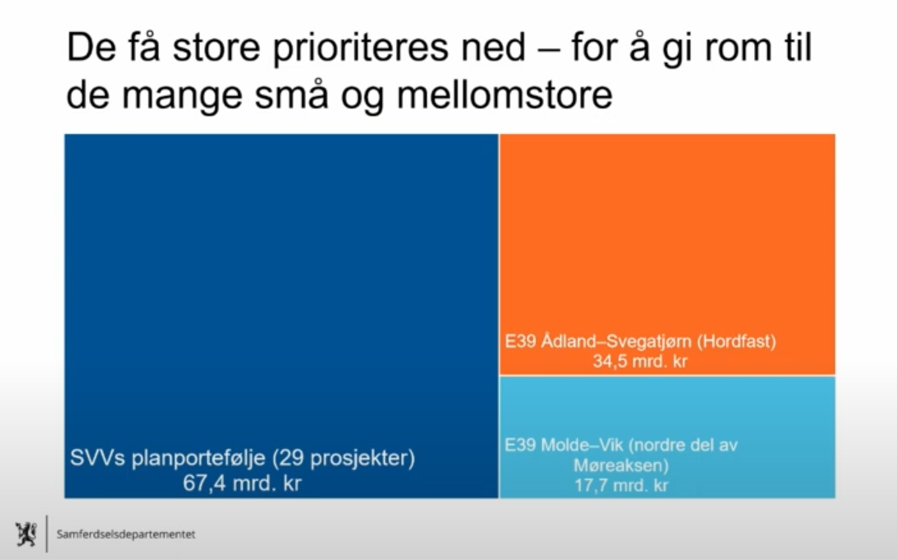
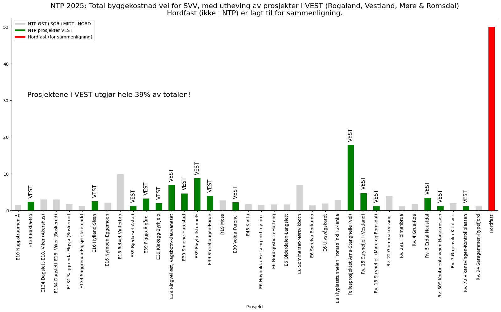
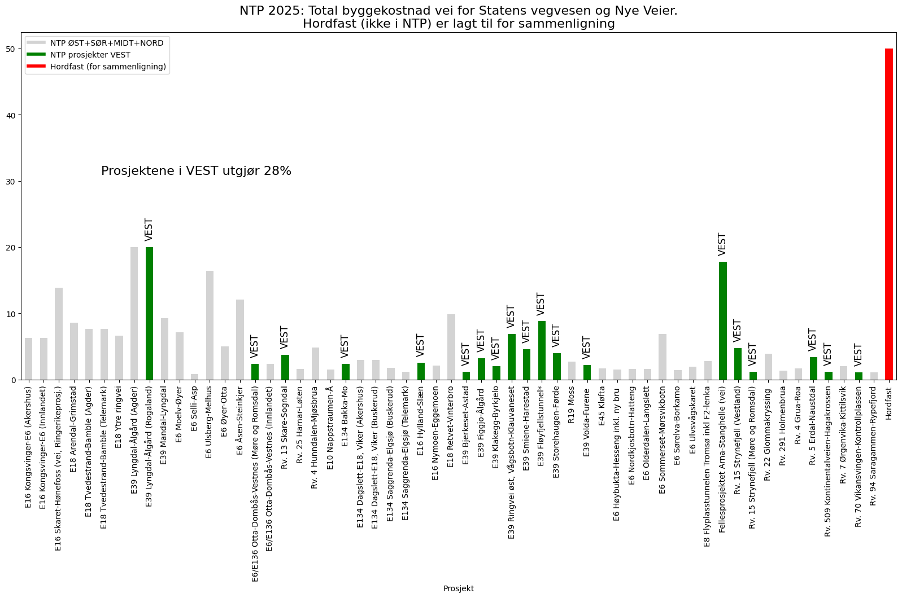
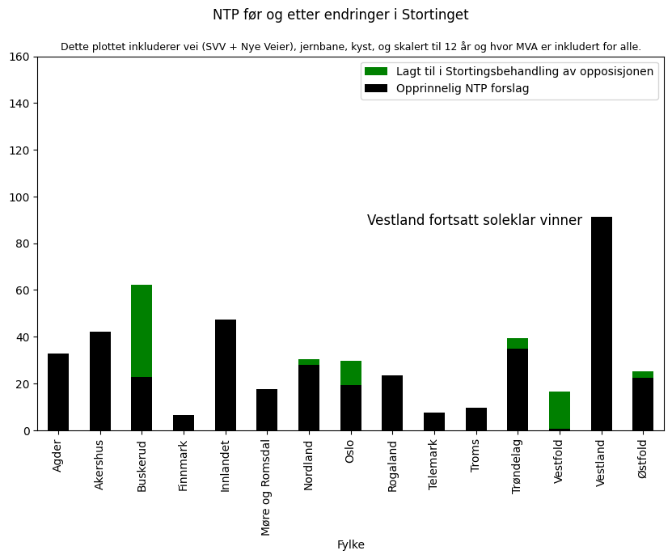
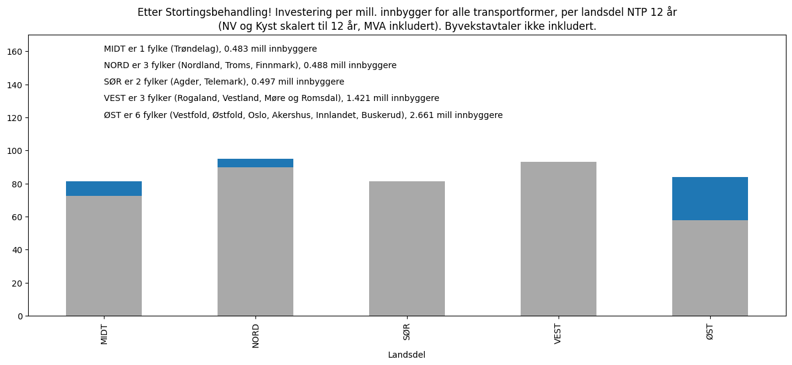
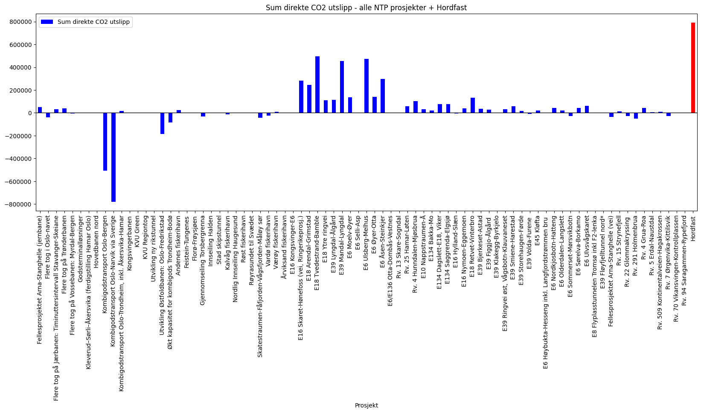
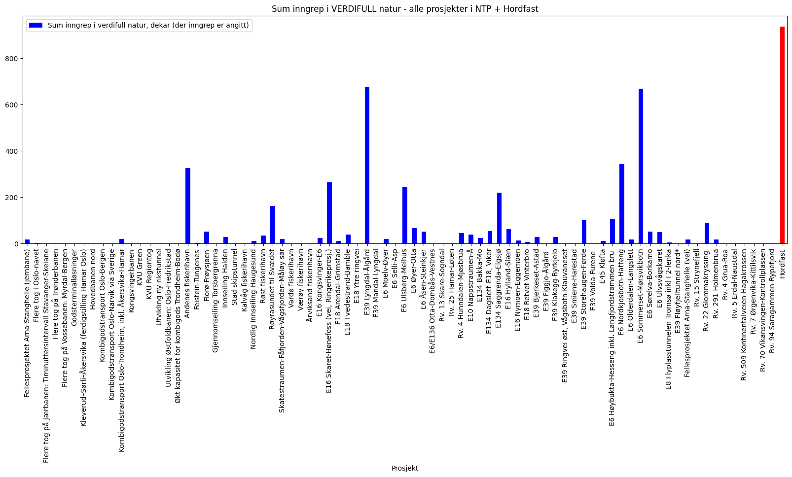
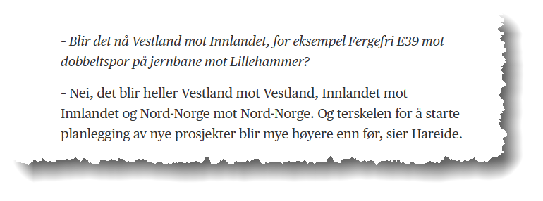

Ny nasjonal transportplan (NTP) ble lagt frem våren 2024. Fylket som kom desidert best
ut av det var Vestland fylke, med blant annet prioritert oppstart av E16 Arna-Stanghelle
pluss en rekke mindre prosjekter, samt betydelig økte midler til rassikring og
vedlikehold. Hordfast ble, av svært gode grunner, lagt midlertidig på is.

## Innledning

Nasjonal transportplan (NTP) 2025–2036 ble lagt frem av regjeringen 22. mars 2024 og
vedtatt av Stortinget i juni samme år. Planen presenterer regjeringens transportpolitikk
med mål om et effektivt, miljøvennlig og trygt transportsystem i hele landet innen 2050.
Prinsippet til Regjeringen er, i prioritert rekkefølge:

- Vi skal ta vare på det vi har,
- Vi skal utbedre der vi kan, og utnytte kapasiteten i eksisterende infrastruktur og
  transporttilbud bedre, og
- Vi skal bygge nytt der vi må.

Planen kom ett år tidligere enn vanlig, da departementet rett og slett mente at forrige
NTP (2022-2033) var urealistisk. Bakgrunn for dette er forklart i
[denne videoen](https://www.youtube.com/watch?v=suaWAGKIMCg).

Et annet viktig prinsipp i siste NTP er mer vektlegging på forsvarstrategiske hensyn,
som følge av den økte aggresjonen i øst.

Den
[totale økonomiske rammen](https://www.jernbanedirektoratet.no/utredninger/nasjonal-transportplan-ntp/nasjonal-transportplan-2025-2036)
for Nasjonal transportplan (NTP) 2025–2036 er 1 308 milliarder kroner. Dette
representerer en økning på 108 milliarder kroner sammenlignet med forrige NTP 2022–2033,
som hadde en ramme på 1 200 milliarder kroner. Rammen ble ytterlige øket under
Stortingsbehandlingen (og trolig ble den da like urealistisk som forrige NTP).

## Hordfast i kjøleskapet, er for rett og slett for dyrt

Noen svært dyre prosjekter, som Hordfast, Møreaksen og Ringeriksprosjektet (togbane) ble
satt i "utviklingsporteføljen", så er betyr utsatt på ubestemt tid. Sistnevnte klarte
imidlertid Høyre med flere å få inn i igjen under behandlingen i Stortinget i juni 2024.
Uten å kutte noe annet selvsagt; opposisjonen har alltid god råd!

Begrunnelsen for å kutte blant annet Hordfast er at det er (alt)for dyrt. Det er en lang
rekke med veiprosjekter i Norge som trenger midler, ofte pga dårlig standard, høy risiko
(for eks rasfare) eller store trafikale problemer.
[I denne videoen begrunner Samferdselsdepartmentet (SDP) sin NTP prosjektledelse](https://www.youtube.com/watch?v=suaWAGKIMCg)
(17 minutter ut i videoen) hvorfor Hordfast er for dyrt. Figuren nedenfor illustrurerer
hvor dyrt Hordfast (og Møreaksen) er sammenlignet med de prosjektene som ble prioritert
i NTP. Dessuten vet nok også SDP at "spenstige prosjekter" som Hordfast har en tendens
til å sprekke så det synger. Forrige eksempel på det var
[Rogfast, som skulle koste 16,8 milliarder i 2017, men som sprakk allerede før byggingen ble satt i gang.](/innsikt/rogfast)
I 2024 er kostnadsrammen til Rogfast på hele 33 milliarder.

_Kilde: Samferdselsdepartementet._

## Hvem er vinnerne i NTP?

Et evig spørsmål er "hvem er vinnerne i NTP"? For å kunne regne litt på dette er det
viktig å vite noen helt fundamentale prinsipper for at regnestykket skal bli riktig:

- Statens Vegvesen sin rammetildeling har en periode på 12 år (6 + 6 år)
- Nye Veier sin ramme er på 20 år. Skal man sammenligne prosjektporteføljen til Nye
  Veier med Statens Vegvesen, må man skalere med brøken 12/20. Dette virker det som for
  eks. ikke
  [Mathias Fischer i "Initiativ Vest" fått med seg i et blogginnlegg](https://initiativvest.no/de-faktiske-tallene-i-nasjonal-transportplan/).
  Det kan også legges til at
  ["dyrtiden" har truffet Nye Veier](https://anlegg.bygg.no/vei/pengemangel-bremser-nye-veiers-aktivitet-kraftig/2708746),
  så de rekker neppe å utføre de mange prosjektene de har fått tildelt i de rammene de
  har fått. M.a.o., det de har i porteføljen er ikke likt det som i realiteten vil bli
  bygget i løpet av de 20 årene!
- Kystverket har en tidsperiode på 6 år, og må skaleres tilsvarende.
- Jernbaneprosjekter bruker ofte summer uten MVA. Dette må korrigeres for.

Samtidig må man vite at det er vanskelig å sammenligne fylker og landsdeler, uten å ta
hensyn til størrelse, både i areal og demografi.

Kilde for de følgende plottene er basert
[på dette regnearket](https://drive.google.com/file/d/1j57XCArnLFvsgUM8pyAgXCDSYZff8KVk/view?usp=drive_link).

### Tildeling av veimidler

Ser vi på SVV sin portefølje, så er det uten tvil VEST (Rogaland, Vestland, More og
Romsdal) som kommer best ut. Av den totale summen til SVV utgjør prosjektene i VEST nær
40%.

Vi ser også at dersom Hordfast hadde vært med, så hadde en lang rekke prosjekter, trolig
de fleste i VEST, røket ut av listen.

_Kilde: Bomfast Info, basert på NTP-data._

Siden Nye Veier også bygger vei (selskapet ble etablert for å akselerere
motorveiutbygging, for det meste på øst- og sørlandet, etter
[initiativ fra regjeringen Solberg i 2015](https://no.wikipedia.org/wiki/Nye_Veier)) så
kan også en sammenstilling der alle veiprosjekter er med inkluderes. Porteføljen til Nye
Veier er skalert med faktor 12/20 som angitt over. Fortsatt utgjør tildelingen til VEST
nær 30%, så
[å hevde at regjeringen nedprioriterer Vestlandet i NTP henger ikke på greip.](https://www.nrk.no/vestland/kritisk-til-regjeringens-ntp-1.16930878)
I realiteten er dette tallet trolig enda noe høyere for VEST, da Nye Veier neppe får
realisert all de prosjektene de har i porteføljen (litt mer om det senere).

_Kilde: Bomfast Info, basert på NTP-data._

### Tildeling per fylke, all transportformer

I figuren nedenfor er alle transportformene (med unntak av luftfart, som uansett er en
veldig liten del av NTP) inkludert, og skalert slik at de er sammenlignbare. Som man ser
i Figur 1a, så er Vestland det fylket som komme absolutt best ut, selv etter at
opposisjonen med Høyre i spissen i Stortingsbehandlingen la betydelig mer penger penger
inn på østlandsprosjekter (spesielt Ringeriksbanen og Vestfoldbanen).

_Kilde: Bomfast Info, basert på NTP-data._

Hvis Hordfast hadde blitt inkludert i tillegg for Vestland, så hadde søylen gått til 140
milliarder, ca 75 milliarder mer enn nest beste fylke! Hvor rettferdig hadde det vært
ovenfor de andre fylkene at Vestland skulle få enda mer?

### Tildeling per landsdel, skalert til folketall

En annen viktig sammenligning kan være sammenligning av landsdeler. En gjentagende
påstand i Hordfast-lobbyistenes ekkokammer er at "østlendingene tar det meste". Lobbyen
har til og med klart å overbevise
[fylkesordfører Jon Askeland (SP!) til å mene det samme](https://www.bt.no/politikk/i/73d7G9/jon-askeland-kritiserer-regjeringen-for-ntp-tapte-bybanen-og-hordfast)
(og han er til og med illojal mot sin egen regjering!)

Spørsmålet er bare hvordan denne sammenligningen kan blir riktig, da noen landsdeler er
betydelig mer folkerike enn andre. I det følgende er landsdelene definert som følger:

- NORD: Finnmark, Troms og Nordland
- MIDT: Trøndelag
- VEST: Møre og Romsdal, Vestland, Rogaland
- SØR: Agder og Telemark
- ØST: Innlandet, Buskerud, Vestfold, Østfold, Akershus, Oslo

For eksempel har ØST hele 48% av befolkningen mens VEST har 26% av befolkningen.

Er det da rimelig at VEST skal få like mye som ØST?

Her er en sammenligning der det blir skal skalererer til bevilgning per innbygger.
Initielt var det VEST som kom best ut her også, men opposisjonen (med Høyre i spissen)
passet på å tildele mer til ØST.

_Kilde: Bomfast Info, basert på NTP-data._

## Hva med klimagassutslipp og naturinngrep?

I NTP arbeidet ble det også presentert tall for klimagassutslipp og inngrep i verdifull
natur. Nå kom ikke Hordfast med i NTP (heldigvis), men hvis det hadde vært med, så hadde
Hordfast prosjektet vært soleklar versting både på utslipp og inngrep.
"[Hordfast er nøkkelen av de grønne skiftet](/innsikt/er-hordfast-noekkelen-til-det-groenne-skiftet)"
hevder lobbyen. Er det mulig?

_Kilde: Bomfast Info, basert på NTP-dokumenter._

## Konklusjon

I motsetning til hva noen i hylekoret i kommentarfeltet, lobbyselskapet Hordfast, en
forvirret fylkeordfører pluss
[noen av BT sine journalister](https://www.bt.no/btmeninger/kommentar/i/JQVadj/hordfast-ute-av-ntp-slik-gaar-det-naar-bergen-manglar-evne-til-aa-skape-si-eiga-framtid)
hevder, som kom Vestland svært godt ut av det opprinnelige NTP forslaget. Høyre og
opposisjonen passet imidlertid på å flytte mer penger tilbake til østlandet i
Stortingsbehandlingen sommeren 2024.

Særlig viktig er signalene i NTP på mer rassikring og vedlikehold her i vest, samt
midler til ny E16. Hordfast er er svært dyrt prosjekt (både kostnadsmessig og
miljømessig) som gjør at dersom det var inkludert, så måtte man ha sagt nei til veldig
mange andre prosjektet over hele landet, men spesielt i Vest
[siden tildelinger til landsdeler settes opp mot hverandre i NTP prioriteringer](https://www.aftenposten.no/norge/i/qLzdl1/i-flere-tiaar-har-de-ventet-paa-ny-riksvei-naa-kan-den-og-flere-andre-veiprosjekter-ryke)
(naturligvis). Det sa i hvertfall daværende samferdselminister Knut Arild Hardeide i
2020, se klippet nedenfor, og vi regner med det gjelder fortsatt...

_Kilde: Aftenposten (2020)._
