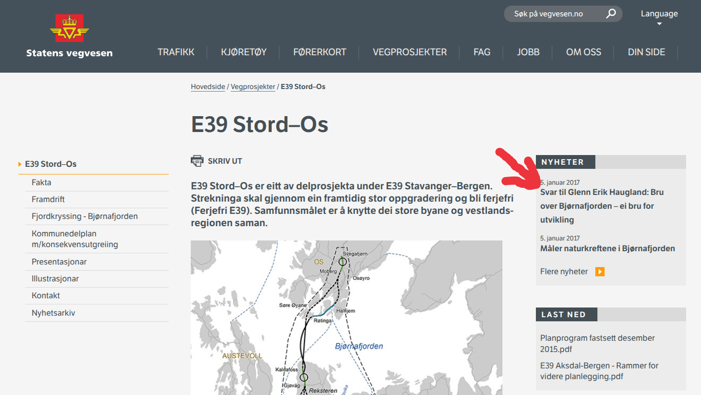

Prosjektleder Signe Eikenes i SVV og Venstre politiker Glenn Erik Haugland i Osøyro hadde noen disputter disse årene. Meget spesielt er jo og at Eikenes brukte Vegvesenet sin infoformasjonsider til Hordfast til å svare på innlegget! Samme innlegg var i Os og Fusaposten, gjengitt her (siden de ble publisert på SVV siden sider også):

---

Glenn Erik Haugland kjem i avisinnlegg med diverse anklagar og påstandar mot Statens vegvesen og andre. Heldigvis er det lite av dette som stemmer. E39 mellom Stord og Os er ein del av den viktige transportåra på Vestlandet. Prosjektet har ein stor samfunnsnyttig verdi for kommunane, for Vestlandet og for heile nasjonen Norge. Det er ei stor investering, ei svært lønsam investering. Med halvert reisetid mellom Bergen og Stavanger får næringslivet betre kår. Det gjev positive ringverknader for heile landet vårt.

Og når reisetida mellom Stord og Os går ned frå 1 ½ time til ½ time blir det ein ny kvardag for innbyggjarane.

Tåkelagd og udemokratisk planprosess? Det er synd at Haugland opplever at planleggingsprosessen er prega av eit "demokratisk underskot". Med statleg plan er det departementet som er planmynde, og ikkje den enkelte kommune. E39 Stord-Os er eit stort prosjekt. Det omfattar fire kommunar, og det er ynske om rask framdrift. Det er grunnen til at det er regjeringa har valt statleg plan, ikkje at konfliktnivået var spesielt høgt. Kommunane er høyringsinstans, og så langt har det vist seg at departementet lyttar godt til uttalane frå kommunane.

Haugland skuldar oss og andre for å tåkelegge rundt planane. Krava til prosess, planinnhald og kvalitet ligg i Plan- og bygningslova, og dei er dei same anten det er ein statleg, regional eller kommunal plan. Alle plandokument med kart og rapportar ligg tilgjengeleg på nettet for alle som ynskjer informasjon. Vi har full forståing for at fagrapportar kan opplevast som tekniske - og til tider lite forståelege. Difor legg vi stor vekt på å få ut informasjon gjennom gode formidlingskanalar som regional- og lokalmedia, nyhendesaker, eigne websider og folkemøte. I dette prosjektet har vi gjennomført fleire folkemøte enn vanleg nettopp for å informera og svara på spørsmål. Alle som har spørsmål er velkomne til å ta kontakt med oss.

Frå overordna plan til meir detaljert plan Haugland stiller spørsmål om prosjektet som mange lurer på. Og desse spørsmåla skal vi svara på. Så langt har vi vore på eit overordna plannivå; Kommunedelplan med konsekvensutgreiing. Det inneber at vi skal velja mellom ulike alternativ for kvar vegen skal gå. Kommunedelplanen, med si detaljering, er i tråd med kva som skal vere på dette nivået i prosessen. Det er gjort eit stort arbeid med å få fram kunnskap på mange fagområde. Dette er tidkrevjande arbeid, med mange involverte fagpersonar. I denne planen har vi klart å jobba tett og effektivt saman, og planen har vi fått fram på kort tid.

Når kommunedelplanen er vedteken, har vi fått rydda bort dei vegalternativa som ikkje er aktuelle. Då kan vi gå i gang med neste planfase: Reguleringsplan. Vi skal då konsentrera oss om detaljane i det alternativet som skal byggast, og fleire av spørsmåla Haugland stiller vil få sine svar.

Ingen støytiltak? Plan- og bygningslova stiller strenge krav til støy og tiltak. Haugland sår tvil om vi vil setja inn støytiltak der det er nødvendig. Så langt har vi vurdert kva geografiske område det vil bli aktuelt med støytiltak. Kva type støytiltak vi skal gjennomføre, høyrer til neste plannivå, og det gjer vi i dialog med kommune, grunneigarar og naboar til vegen.

Kom gjerne med merknader E39 Stord-Os er eit stort prosjekt. Det vil påverka område vegen skal gå gjennom - på godt og vondt. Statens vegvesen er oppteken av å gjennomføra grundig fagleg arbeid og gode prosessar slik at vi saman med kommunar og innbyggjarar finn dei beste løysingane for folk flest, næringslivet og landsdelen vår. For dei som vil koma med merknader til kommunedelplanen, er fristen sett til 20.januar. Alle dokument ligg opne på www.vegvesen.no.

