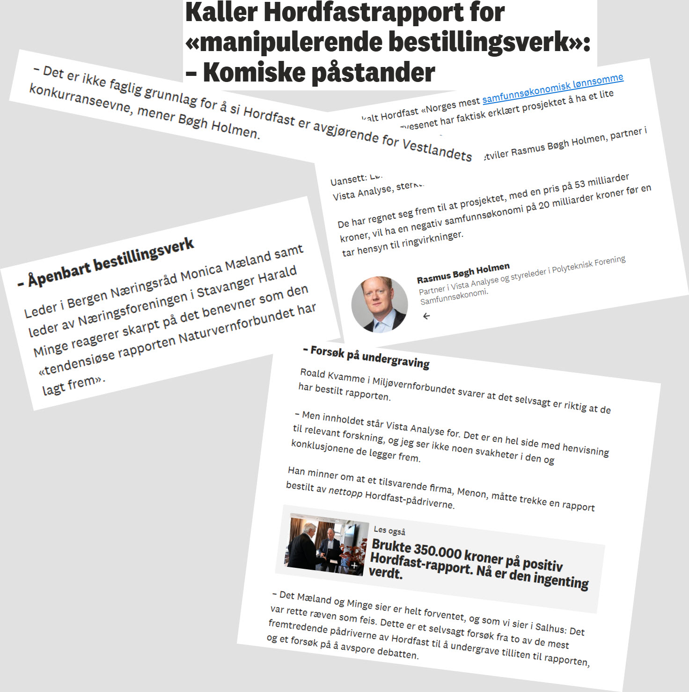

Vista analyse har laget en grundig rapport om samfunnsnytten til Hordfast. Harald Minge
(og Monica Mæland?) kaller rapporten, trolig uten å lest den, for "et manipulernede
bestillingsverk". Det sier vel mest om det skuffende lave nivået til Minge/Mæland!
Rapporten er etter mitt syn svært grundig og nøktern.

Klipp fra reportasjeon

