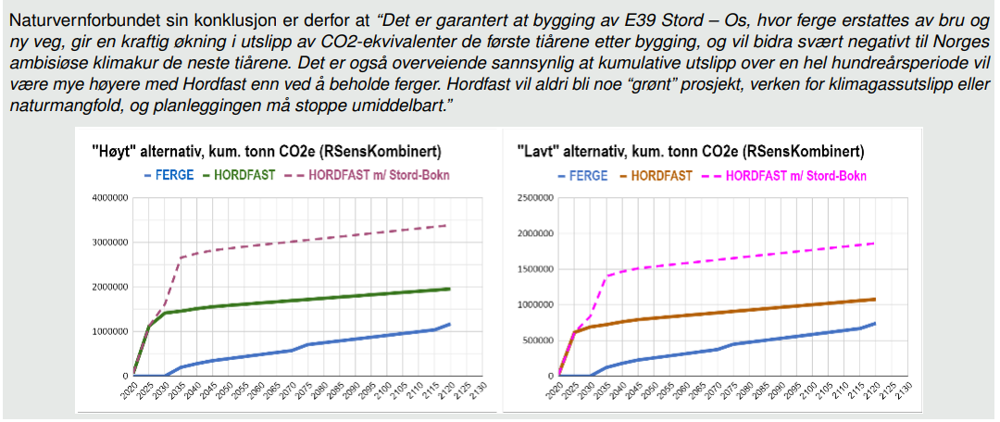

---
title:
  "Statens vegvesen sin rapport om klimagassutslipp fra Hordfast har feil forutsetninger
  og dermed feil konklusjon"
date: 2022-09-26
type: "rapporter"
institusjon: "Norges naturvernforbund"
forfatter: "NNV-Hordaland"
external_url: "https://naturvernforbundet.no/content/uploads/sites/13/2022/11/Naturvernforbundets-motrapport-mot-SVV-som-mener-Hordfast-er-et-klimatiltak-300922.pdf"
---

Statens vegvesen (SVV) konkluderer i en offentlig rapport (mars 2022) om
klimagassutslipp som følge av Hordfast at “Det er svært sannsynlig at bygging av E39
Stord–Os, hvor ferje erstattes av bru og ny veg, gir en nedgang i utslipp av CO2-ekv,
sett over en hundreårsperiode. Dette er i motsetning til de fleste nye veganlegg som
vanligvis gir økte utslipp av CO2-ekv.”.

Norges Naturvernforbund har nå gått grundig igjennom regnemetodikk og inngangsverdier og
finner i tillegg til rene regnefeil at flere sentrale forutsetninger er usannsynlige.

Naturvernforbundet er rimelig sikker på at SVV sitt estimat for energibruk til dagens
ferger er betydelig overestimert. Basert på en grundig analyse av publisert materiale
samt intervjuer så nedskalerer vi energibruken til ca. 60 % av det SVV foreslår. Videre
må regnestykket ta med den forventede effektiviseringen innen skipstrafikken. Vi mener
også at nybygging av ferger hvert 25 år er et urealistisk kort intervall, i hvert fall
når vi også tar hensyn til at ferger som tas ut av sambandet, som regel har en
alternativ anvendelse på andre samband i Norge eller i utlandet.

En annen følsom inngangsverdi er CO2e innhold i el-miksen over tid, som SVV har satt
konstant over 100 år til en verdi som er 3 til 6 ganger høyere enn livsløpsverdien for
norsk el-miks ifølge Norsk Standard (NS 3720). Med det svært høye fokuset
de-karbonisering av energiproduksjonen har både i Norge og Europa mot år 2050 og videre,
så er vi uenige både i valg av nivå og antagelsen om konstante verdier. En interessant
observasjon her er at Statens vegvesen forutsetter i sin analyse at Europa ikke lykkes
med omstilling til (nær) karbon-nøytralitet innen 2050 slik de politiske målene er.
Naturvernforbundet forventer derimot at karbonintensiteten til den europeiske
strømmiksen vil falle drastisk i løpet av et par tiår, i tråd med ambisjonene om
utslippskutt, og vi viser alternative scenarioer basert på dette.

Naturvernforbundet mener også at regnestykket må ta inn et viktig tilleggselement,
nemlig at bygging av Hordfast vil legge til rette for ytterligere motorveiutbygging
mellom Bergen og Stavanger (Bokn-Stord). Faktisk eskaleres nå planleggingen av
Stord-Bokn (74 km motorvei) i regi av SVV nettopp som følge av forventningen om at
“Rogfast og Hordfast kommer”. Dette vil gi nye svært høye utslipp fra bygging og
arealinngrep, og bidra til ytterligere trafikkøkning.

I 2019 var det litt over 8000 flyreiser mellom Bergen og Stavanger. Uttrykt i antall
flyreiser (med dagens flyteknologi) vil bare byggeog arealutslipp fra Hordfast alene
tilsvare om lag 8000 flyreiser pr. år for Bergen-Stavanger de neste 60 årene, mens
ytterligere utbygging av motorvei Bokn-Stord tilsvarer 8000 årlige reiser i 120 år. Med
forventet effektivisering og teknologiutvikling innen luftfarten blir tallene enda
verre. Vi anslår også at det er sannsynlig at den økte trafikken som følge av fergefri
og utbedret E39 mellom Bergen og Stavanger vil gi en netto økning også i total
energibruk sammenlignet med nullalternativet (fortsatt fergedrift) i år 2050.

Usikkerheten i en slik analyse øker betydelig med tid. Bruker vi 60 års analyseperiode
etter åpning slik praksis er i alle andre samferdselprosjekter, så viser både SVV sine
grafer og vårt alternativ at Hordfast gir stor netto økning i klimagassutslipp over hele
60-års-perioden, og spesielt de første tiårene. Høye utslipp i en tidlig fase vil
forsterke klimautfordringene og gjøre at klimaendringene påvirker kloden i en lengre
periode enn om tilsvarende utslipp kommer senere, og derfor haster det med å kutte
utslipp raskt og mye.

Naturvernforbundet sin konklusjon er derfor at “Det er garantert at bygging av E39 Stord
– Os, hvor ferge erstattes av bru og ny veg, gir en kraftig økning i utslipp av
CO2-ekvivalenter de første tiårene etter bygging, og vil bidra svært negativt til Norges
ambisiøse klimakur de neste tiårene. Det er også overveiende sannsynlig at kumulative
utslipp over en hel hundreårsperiode vil være mye høyere med Hordfast enn ved å beholde
ferger. Hordfast vil aldri bli noe “grønt” prosjekt, verken for klimagassutslipp eller
naturmangfold, og planleggingen må stoppe umiddelbart.”

