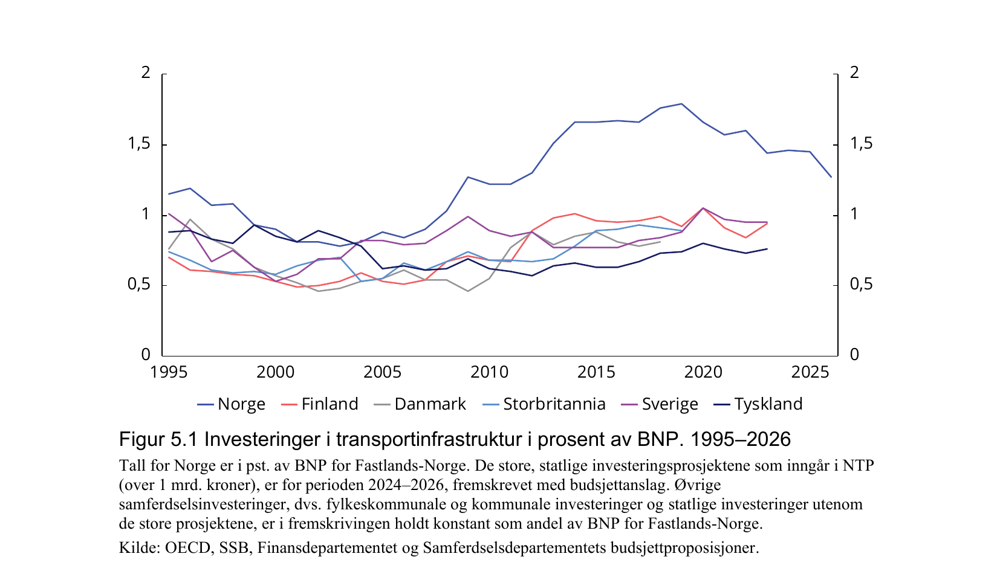

- Årlig uttalelse fra det regjeringsoppnevnte «Rådgivende utvalg for finanspolitiske
  analyser», ledet av professor Ragnar Torvik (populært kalt «Torvik-utvalget»). Kapittel
  5 tar for seg samfunnsøkonomisk lønnsomhet i norske samferdselsinvesteringer.

- **Norge bruker langt mer på samferdsel enn sammenlignbare land**, ikke mindre:
  investeringene i transportinfrastruktur lå i 2014–2022 på rundt **1¾ % av BNP for
  Fastlands-Norge** – en fordobling siden årtusenskiftet. Figur 5.1 (under) viser at
  Norge har ligget klart over Finland, Danmark, Storbritannia, Sverige og Tyskland i
  hele perioden, og forskjellen har økt kraftig siden ca. 2010.

- Til tross for det høye investeringsnivået har **samfunnsøkonomisk lønnsomhet i
  porteføljen falt jevnt og er nå sterkt negativ**. Netto nytte per investeringskrone i
  Nasjonal transportplan har gått fra +0,28 (NTP 2002–2011) til **-0,37 (NTP
  2025–2036)**. Bare en femtedel av prosjektporteføljen i NTP 2025–2036 er beregnet å ha
  positiv netto nytte.

- Utvalget viser til at både **Produktivitetskommisjonen (NOU 2015:1)** og **OECD i et
  spesialkapittel om norske samferdselsinvesteringer fra 2018** har pekt på strukturelle
  årsaker: uavklarte målkonflikter, dårlig samsvar mellom hvem som bestemmer og hvem som
  betaler, fragmenterte beslutningsprosesser der NTP-prosjekter er vanskelige å stoppe
  selv ved store kostnadssprekker, og norsk geografi/spredt bosetting.

- **Sammenlignet med Sverige** er forskjellen slående: Welde et al. (2013) fant at
  samfunnsøkonomisk lønnsomhet var avgjørende for hvilke prosjekter som ble prioritert i
  den svenske transportplanen, mens lønnsomhet ikke hadde noen signifikant påvirkning på
  norske prioriteringer i NTP 2014–2023.

- Utvalgets anbefaling er at nye, store samferdselsprosjekter ikke bør startes med mindre
  de er samfunnsøkonomisk lønnsomme, og at NTP-rammen til nye store
  investeringsprosjekter kuttes med 30 % i løpet av stortingsperioden.

