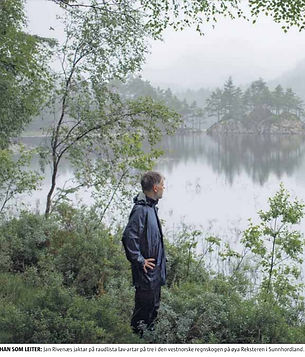

Bomfast.info er en alternativ informasjonsside om E39 Hordfast og relaterte
samferdselsprosjekter. Siden drives ubetalt og har ingen kommersielle eller
partipolitiske bindinger. Faktagrunnlaget er primært offentlige dokumenter fra Statens
Vegvesen, Nasjonal transportplan (NTP), kvalitetssikringsrapporter og andre åpne kilder.
Konstruktive korrigeringer og kommentarer mottas med takk – se [Kontakt](/kontakt/).

## Hordfast engasjerer

Nesten alle som engasjerer seg i en sak, gjør det fordi de blir berørt av den, direkte
eller indirekte. Slik er det også med Hordfast. Noen ønsker prosjektet fordi de tror det
vil gi kortere reisetid, sterkere arbeidsmarked, mer aktivitet i Sunnhordland eller økte
eiendomsverdier. Andre er imot fordi de mener kostnadene og risikoen er for store, fordi
de er bekymret for naturtap og økte klimagassutslipp, eller fordi de selv vil leve tett
på et svært inngripende anlegg.

Det gjør ikke engasjementet mindre legitimt. Tvert imot er det ofte nettopp de som blir
berørt, som har mest grunn til å sette seg grundig inn i saken. Det avgjørende i en
demokratisk debatt er derfor ikke om folk har et ståsted, men om argumentene deres tåler
saklig diskusjon. Folk skal ikke diskvalifiseres fra debatten fordi de har noe å tape,
noe å vinne eller ganske enkelt noe å verne om.

Likevel prøver enkelte å svekke motpartens troverdighet ved å peke på motivene deres,
som i eksemplet under:

Slike angrep flytter oppmerksomheten bort fra saken og over på personen. Det er en
velkjent debatt-teknikk: Hvis man ikke kan avvise argumentene, forsøker man å avvise den
som fremfører dem. Det er verken særlig konstruktivt eller særlig demokratisk. Hvis
nærhet til en sak skal diskvalifisere folk fra å mene noe, må samme prinsipp i så fall
gjelde langt bredere:

- Dersom du eier bolig, har du da ingen rett til å mene noe om eiendomsskatt?
- Dersom du er småbarnsforelder, har du da ingen rett til å mene noe om skolepolitikk?
- Dersom du er pasient eller pårørende, har du da ingen rett til å mene noe om
  helsevesenet?
- Dersom du har formue, har du da ingen rett til å debattere formueskatt?
- Dersom du bor nær en planlagt flyplass, togtrase eller motorvei, har du da ingen rett
  til å mene noe om et inngrep som vil endre nærmiljøet ditt?

Å ha et ståsted, enten man er for eller mot, er legitimt. Det viktige er å diskutere
sak, ikke å avvise folks deltakelse på grunn av deres tilknytning til saken. At jeg har
eiendom nær traseen, gjør ikke mine argumenter mer eller mindre gyldige i seg selv; de
må vurderes på innholdet. Hvis argumentene er svake, får man vise hvorfor de er svake.
Hvis de er sterke, hjelper det lite å stemple avsenderen. For min del bidrar ikke
[ad hominem](https://no.wikipedia.org/wiki/Ad_hominem-argument)-angrep i debattinnlegg
og kommentarspalter til en saklig offentlig debatt.

Et annet eksempel på tvilsom debatt-teknikk ble gitt av
[KrF-politiker Tore Grønås i BA i 2022](https://www.ba.no/hordfast-til-folket/o/5-8-1821544):

Hordfast er et omstridt prosjekt, og det er like lite relevant å avvise kritikere fordi
de har lokal tilknytning, som det er å avvise tilhengere fordi de bor et annet sted enn
der inngrepene kommer. Argumentene må møtes med argumenter. Alt annet er en avsporing.

## Min bakgrunn

Jeg heter Jan C. Rivenæs og står bak denne siden. Jeg har en dr.ing.-grad fra NTH (NTNU)
innen geologisk og matematisk modellering, og har jobbet mye med programmering og
dataanalyse. Nå er jeg pensjonist, eller "uavhengig frilanser" som jeg liker å kalle
det. På fritiden driver jeg blant annet med naturfotografi (makro og landskap) og
akvarier. Jeg regner meg som "hobbybiolog" og er aktiv med registreringer på
Artsobservasjoner.

Spesiell interesse innen biologi er amfibier, øyenstikkere og ikke minst de spesielle
oseaniske lavartene vi finner i den unike og sjeldne boreonemorale regnskogen på Tysnes.
For øvrig er jeg medlem av
[Naturvernforbundet i Hordaland](https://naturvernforbundet.no/) og støttemedlem både i
[Norges Miljøvernforbund](https://www.nmf.no/) og [WWF Norge](https://www.wwf.no/). Jeg
er ikke, og har aldri vært, medlem av noe politisk parti.

## Min tilknytning til Bårdsundet

Familien min på ektefellesiden har hatt eiendom i Bårdsund siden ca. 1850. Jeg er
medeier i en liten andel (m.a.o. jeg er ingen "stor grunneier"). Fritidsboligen og
eiendommen vil ikke rammes direkte av en eventuell ny E39 – vi er mellom en halv og en
kilometer unna planlagt trasé. Det er mange på Tysnes, Os og Stord som vil rammes langt
hardere. Vi vil likevel rammes indirekte av støy fra ny vei, ødelagt natur og kraftig
forringet landskapsbilde i store deler av Bårdsundet. Mye unik og rødlistet natur og et
rikt kulturminnemiljø vil også gå tapt.

Fordi jeg har vært hovedforfatter i flere høringer fra Bårdsundet, har jeg satt meg
veldig grundig inn i saken. Jeg har lest alle dokumenter nøye og kjenner historikken
bedre enn de aller fleste. Etter hvert har dette utviklet seg til en bredere interesse
for samferdselsprosjekter generelt, og siden tar derfor også opp relaterte tema som
"Fergefri E39", "NTP", "byggekostnader" og lignende.

## Fra Bårdsundet til hele Hordfast

Opprinnelig var siden her primært om naturperlen Bårdsundet og kampen for å bevare det.
Vi har i høringene og i avisinnlegg kjempet for en senketunnel (eller lengre tunnel)
under sundet. En senketunnel er langt fra noen ideell løsning, men tross alt en mye
bedre løsning enn en bro i dagen. Vegvesenet har imidlertid jobbet kraftig og målrettet
mot tunnel – til tross for at både Fylkesmannen (nå Statsforvalteren) og Fylkeskommunen
støttet en tunnelløsning – og dessverre vant Vegvesenet frem. Så langt i hvert fall.

Men dette er mye større enn Bårdsundet; det handler om vår felles fremtid. Personlig
mener jeg prosjektet er så dyrt, så risikabelt og så naturødeleggende at det bør
droppes, uavhengig av løsning i Bårdsundet. Siden handler derfor nå om generelle tema
rundt "E39 Hordfast" samt relaterte tema innen samferdsel.

---

Vil du ta kontakt, eller har du innspill eller rettelser? Gå til [Kontakt](/kontakt/).
